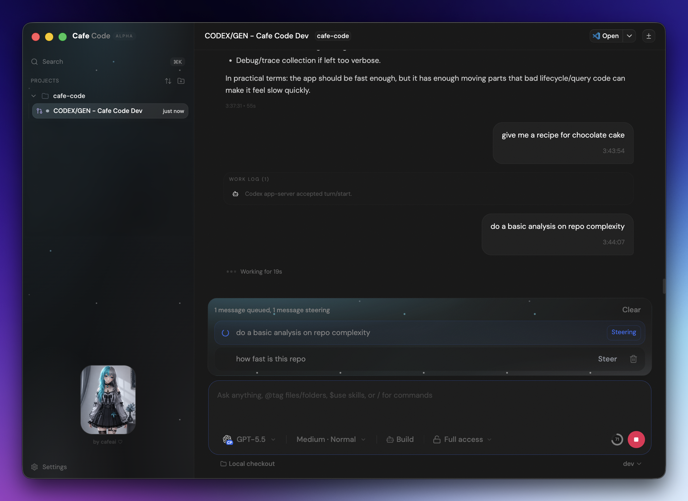

# Cafe Code



Made in Japan with love.

**Warning**: Large parts of the application are currently under development and have been completely rewritten. It may take some time for the system to become stable.

_Cafe Code is very small, barely does a thing at all. Chat goes in and chat comes out, soft and sweet, without a shout._

Cafe Code is a tiny desktop GUI for coding agents. It is a fork of [T3 Code](https://github.com/pingdotgg/t3code), with a basket of bug fixes, a little sweep-up, and some very opinionated trimming for people who want the agent chat and not much else.

It is meant to stay light, calm, and out of the way — not freeze, drag, or get all sleepy like so many other clients do.

T3 Code said it wanted to be minimal. Cafe Code went even smaller.

No terminal drawer. No pretend IDE. No giant dashboard wearing a useful-looking hat. If you want a console, use a real console. If you want to inspect code, open it in VS Code.

<p align="center">
  
</p>

## Why Fork?

Because the app should stay small, fast, and predictable.

Bug fixes are welcome. Performance fixes are welcome. Reliability fixes are
welcome. Security fixes are extra welcome.

Feature requests need to pass the tiny-window test: does this make Cafe Code
smaller, calmer, faster, easier to understand, lower CPU, lower memory, or less
annoying when something fails?

If yes, maybe.

If it turns Cafe Code into a pretend IDE, a pretend terminal, a release
dashboard, a project-management suite, or a museum of buttons, no.

## What Changed From T3 Code

This is the practical working list. It will probably get cleaned up later.

- Completely rewrote the lifecycle system to be more inline with Codex and Claude.
- Numerous bug fixes.
- Excessive debugging information.
- Rebranded the app around Cafe Code.
- Moved local app data into `~/.cafe-code`.
- Removed the in-app terminal drawer and terminal UI.
- Removed hosted web-app assumptions and focused the project on the Electron app.
- Disabled update checks until Cafe Code has its own release path.
- Added a queue/follow-up workflow for prompts sent while a provider is running.
- Added provider-aware queue actions: steer when supported, interrupt when that
  is the honest behavior.
- Added thread moving between project folders and working directories.
- Added "Move to Recycle Bin", "Recently Deleted", restore, permanent delete,
  and empty recycle bin flows.
- Added a default editor setting for VS Code, Antigravity, Finder, or system
  default.
- Made file-change rows and path pills open real paths instead of truncated
  display text.
- Added a localhost-only debug endpoint behind `--cafe-debug`.
- Reduced needless Git polling and checkpoint churn.
- Hardened hidden checkpoint handling, ignored-file capture, and old ref pruning.
- Fixed provider/session edge cases around reconnects, stale running state,
  resume metadata, and null checkpoint timestamps.
- Removed or hid features that do not belong in a minimal coding-agent shell.

## Run From Bun For Now

For now there are no desktop packages. No DMG, no updater, no notarized bundle,
no "drag this into Applications" ceremony.

The npm package exists, but do not treat it as the fresh install path yet. It
will probably be out of date until Cafe Code settles down a little more. The app
is in pretty good shape now, but the fastest-moving build is still the repo
itself.

Mostly tested on macOS. Windows seems to work. Linux may need a little tweaking;
I have not had enough time on it yet.

Install [Bun](https://bun.sh/docs/installation) first if it is not already on
your machine, then run Cafe Code from a checkout:

```bash
git clone https://github.com/cafeai/cafe-code.git
cd cafe-code
bun install
bun run build:desktop
bun run --cwd apps/desktop start
```

Debug mode:

```bash
bun run --cwd apps/desktop start -- --cafe-debug
```

### Browser Web UI Firewall Ports

If you want to open the Cafe Code Web UI from another device on your LAN, first
enable network/LAN access in Cafe Code, then allow the desktop backend ports
through your firewall. The default desktop ports are:

- HTTPS/WSS Web UI: `3775/tcp`
- HTTP/WS fallback and certificate bootstrap page: `3773/tcp`

For `ufw`:

```bash
sudo ufw allow 3775/tcp comment 'Cafe Code HTTPS'
sudo ufw allow 3773/tcp comment 'Cafe Code HTTP'
```

For local development with `bun run dev:desktop`, the default ports are:

```bash
sudo ufw allow 13775/tcp comment 'Cafe Code dev HTTPS'
sudo ufw allow 13773/tcp comment 'Cafe Code dev backend'
sudo ufw allow 5733/tcp comment 'Cafe Code dev Vite'
```

If Cafe Code prints a different port, or you run with `CAFE_CODE_PORT`,
`CAFE_CODE_HTTPS_PORT`, `CAFE_CODE_DEV_INSTANCE`, or
`CAFE_CODE_PORT_OFFSET`, allow the printed port instead.

### Saved Remote Servers

The Connections settings can save direct connections to other reachable Cafe
Code servers using a pairing URL or a host plus pairing code. Cafe Code scopes
projects, threads, providers, and live subscriptions to the selected server.

Cafe Code does not create SSH or Tailscale tunnels. Configure the network,
certificate, firewall, or reverse proxy separately, then use the server's
pairing details. Desktop credentials are encrypted with Electron safe storage;
browser credentials are retained only for the current browser session.

If you want Codex or Claude to do it for you, paste this into the CLI:

```text
Install Cafe Code from source with Bun. Clone https://github.com/cafeai/cafe-code.git, install Bun if it is missing, run bun install, run bun run build:desktop, then start it with bun run --cwd apps/desktop start. Also verify Codex CLI is installed and logged in with codex login, and Claude Code is installed and logged in with claude auth login if I want Claude support.
```

The old npm path is still here for later, but it may lag behind current work:

```bash
npx @cafeai/cafe-code
npm install -g @cafeai/cafe-code
cafe-code
```

Cafe Code expects at least one provider to already be installed and
authenticated:

- Codex: install [Codex CLI](https://developers.openai.com/codex/cli) and run `codex login`
- Claude: install [Claude Code](https://claude.com/product/claude-code) and run `claude auth login`
- OpenCode: install [OpenCode](https://opencode.ai/docs/) and configure at least one upstream provider, or configure Cafe Code with an existing OpenCode server URL

Cafe Code currently ships Codex, Claude, and OpenCode provider integrations.

## Local Development

Run the app from a checkout:

```bash
bun install
bun start:desktop
```

Run the desktop package directly:

```bash
bun --cwd apps/desktop start
```

Debug mode:

```bash
bun start:desktop:debug
```

The app prints a localhost-only debug URL on startup.

Useful checks:

```bash
bun fmt
bun lint
bun typecheck
bun run test
```

Do not run `bun test`; this repo uses `bun run test`.

### Local Arch Package

Build a local pacman package from the Linux AppImage artifact:

```bash
bun install
bun run dist:arch:local
sudo pacman -U release/arch/cafe-code-*.pkg.tar.zst
```

To build and install in one step:

```bash
bun run dist:arch:local -- --install
```

This is intentionally local packaging only. It does not create AUR metadata or
publish anything.

## 日本語でちゅ

Cafe Code は、Codex とか Claude とお話するための、
ちいさめデスクトップアプリだわ。

T3 Code から fork して、
バグ直して、重いところ軽くして、
いらない機能はぽいぽいした。

ターミナルいらない。
でかいダッシュボードいらない。
ボタンだらけの謎コックピットもいらない。

コード見たいなら VS Code ひらこ。
コンソール使いたいなら、本物のコンソール使お。

Cafe Code は、チャットする。
作業を見る。
邪魔しない。
それだけ。えらい。

### いまは Bun から動かす

まだ DMG とか、インストーラーとか、アップデーターとかはないよ。
npm のパッケージもあるけど、今はそれを信じすぎないでね。
Cafe Code がもう少し落ち着くまでは、npm はたぶん少し古くなる。

Bun がなければ先に入れてね。入れ方は
[Bun の公式ページ](https://bun.sh/docs/installation) がいちばん確か。

```bash
git clone https://github.com/cafeai/cafe-code.git
cd cafe-code
bun install
bun run build:desktop
bun run --cwd apps/desktop start
```

デバッグしたいならこれ。

```bash
bun run --cwd apps/desktop start -- --cafe-debug
```

LAN の別デバイスから Cafe Code の Web UI を開きたいなら、先に Cafe Code
側でネットワーク/LAN アクセスを有効にして、ファイアウォールでこのポートを開ける。

- HTTPS/WSS Web UI: `3775/tcp`
- HTTP/WS のフォールバックと証明書案内ページ: `3773/tcp`

`ufw` ならこれ。

```bash
sudo ufw allow 3775/tcp comment 'Cafe Code HTTPS'
sudo ufw allow 3773/tcp comment 'Cafe Code HTTP'
```

`bun run dev:desktop` の開発中は、デフォルトではこっち。

```bash
sudo ufw allow 13775/tcp comment 'Cafe Code dev HTTPS'
sudo ufw allow 13773/tcp comment 'Cafe Code dev backend'
sudo ufw allow 5733/tcp comment 'Cafe Code dev Vite'
```

Cafe Code が別のポートを表示しているときや、`CAFE_CODE_PORT`、
`CAFE_CODE_HTTPS_PORT`、`CAFE_CODE_DEV_INSTANCE`、`CAFE_CODE_PORT_OFFSET`
を使っているときは、その表示されたポートを開けてね。

だいたい macOS で見てる。Windows も動いてそう。
Linux はまだあまり見れてないから、ちょっと調整がいるかも。
でも今の Cafe Code は、けっこういいところまで来てる。

Codex とか Claude に丸投げするなら、これを投げてもいいよ。

```text
Cafe Code を Bun でソースから入れてください。https://github.com/cafeai/cafe-code.git を clone して、Bun がなければ入れて、bun install、bun run build:desktop、bun run --cwd apps/desktop start まで実行してください。Codex を使うなら codex login、Claude を使うなら claude auth login も確認してください。
```

npm 版は残しておくけど、今は古いかもしれない。

```bash
npx @cafeai/cafe-code
npm install -g @cafeai/cafe-code
cafe-code
```

Codex を使うなら先に `codex login`。
Claude を使うなら先に `claude auth login`。
そこは自分でログインしておいてね。

```bash
bun fmt
bun lint
bun typecheck
bun run test
```

`bun test` は使わないでね。
このリポジトリは `bun run test` の子なの。

## License

Cafe Code is AGPL-3.0-or-later.

The fork keeps the upstream attribution story intact; see the license and notice
files for details.
