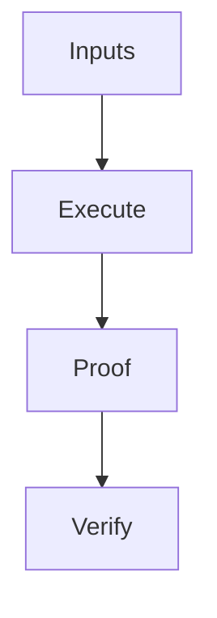

# Mermaid diagrams in chat

Cafe renders closed code fences labeled `mermaid`. The first line inside the
fence declares the diagram type: for example, `flowchart TD` means a top-to-bottom
flowchart. The `flowchart` declaration is part of Mermaid, not a replacement for
the fence's language label.

````markdown

````

Supported families are flowcharts (`flowchart`/`graph`), sequence diagrams,
class diagrams, state diagrams, entity-relationship diagrams, XY charts
(`xychart`/`xychart-beta`, bar and line plots), and pie charts (`pie`, including
`showData`). Ordinary code
blocks are unchanged. Untagged diagrams, unsupported families, incomplete fences,
invalid syntax, and diagrams exceeding resource limits remain copyable source.
XY charts support category or numeric X axes, named plots, optional point labels
and horizontal orientation. Pie charts retain small entries in the legend even
when the pinned renderer omits their slices below 1% from the drawing.

## Controls and streaming

- **Diagram / Source** switches between the image and original Mermaid DSL.
- **Copy** copies that DSL, without adding fences or altering its contents.
- **Expand** opens a larger view with Fit, Reset, zoom, scrolling and pointer
  panning. Escape closes it and restores keyboard focus.
- **⋯ Image actions** offers **Copy image** and **Save as PNG**, in the inline
  toolbar and expanded viewer. Copy writes an actual PNG image and confirms
  with a brief toast; the existing Copy button still copies the original DSL.
  Save opens the desktop's native destination picker, or downloads a PNG in a
  browser. Successful saves and cancellation are quiet.

Image export captures the complete diagram at intrinsic resolution, irrespective
of scroll position, Fit or zoom. The opaque background matches its rendered theme.
Images beyond the shared bitmap budget are proportionally reduced, never cropped.
The limits are defined in `packages/contracts/src/imageExport.ts`. An incomplete,
failed or still-changing themed diagram cannot export an image; Source remains
available. A browser without image clipboard permission/support can still save
as PNG. Browser download dispatch is not a receipt that the OS wrote the file.

Markdown tables have the same three-dot image menu in both views. Full-content
exports preserve text, table borders, code, emphasis, link labels and rendered
math, using bundled local typefaces. App-owned decorative file icons use local
File/Folder glyphs; ordinary embedded images must already be decoded and readable
without a new fetch. Unsupported, unreadable or oversized content fails visibly
instead of producing a silently incomplete table. Export never follows links,
replays provider work, reads the clipboard or sends content to a remote renderer.
See the [image export decision](decisions/diagram-table-image-export.md) for
resource, publication, lifecycle and verification boundaries.

Diagrams render as soon as their own closing fence arrives, even while later
prose is still streaming. Unclosed fences stay source even in truncated history.
Long diagrams scroll within a bounded preview; they do not widen the chat or
shrink vertically into unreadable thumbnails. Controls follow Cafe's theme and
interface scale. Screen-reader labels use Mermaid `accTitle`/`accDescr` when
present, with Source always available as a text alternative.

The shared renderer also covers authored plans and subagent output. No provider
calls, extra inference tokens, transcript migration, or network diagram service
are involved. Old messages render when reopened.

## Deliberate limits

Rendering uses a local, pinned Mermaid Tiny build. HTML labels, source-supplied
configuration/frontmatter, click/link directives, and image nodes are not enabled.
The source remains available when these constructs cannot be rendered. SVG is
sanitized separately and displayed as an image; it cannot become active chat DOM.
User-supplied animation, filters and layout CSS do not survive output admission.

Sources are limited to 32 KiB UTF-8, with at most 250 parsed nodes and 250 parsed
connections/messages per graph (state/class auxiliary items count too). XY charts
count categories/numeric ticks plus series against the node limit, and aggregate
plotted points and aggregate retained point labels each against the connection
limit. Pie charts count every parsed section, including zero or tiny entries.
Numeric data must be finite, within the final axis domains, and produce finite
nonempty tick/angle calculations. Empty/all-zero pies, charts without plots and
unsafe numeric ranges fall back to source. Results
are limited to 2 MiB SVG. One job runs at a time per app window, with at most 64
pending identities, and an in-memory 128-entry / 16 MiB cache. Cache entries bind
the complete source, theme, library version and policy. Nothing is persisted in
local storage or transmitted to a provider.

An asynchronous 15-second deadline releases stalled jobs. It is not a hard CPU
deadline: a sandboxed iframe is not guaranteed a separate browser thread, and a
timer cannot preempt synchronous layout. Source and parsed-graph bounds therefore
apply before layout. See the [architecture decision](decisions/mermaid-rendering.md)
for trust-boundary details and the verification limitations. The
[chart admission decision](decisions/mermaid-chart-admission.md) records the
pinned parsed contracts and numeric/resource defenses. Flowchart IDs such as
`LINK` are ordinary nodes, not sequence/class link directives; multiline quoted
labels using `<br/>` remain supported with HTML labels disabled.

## Verification and dependency updates

Use the repository's pinned Node and Corepack Yarn. Focused checks:

```sh
corepack yarn workspace @cafecode/web test src/lib/remarkMermaid.test.ts src/lib/chatMarkdownMermaid.test.ts src/lib/chatClipboard.test.ts src/lib/mermaid/renderService.test.ts
corepack yarn workspace @cafecode/web test:browser src/components/ChatMarkdown.browser.tsx src/components/MermaidBlock.browser.tsx src/components/MermaidPreview.browser.tsx src/components/MermaidRendering.browser.tsx src/components/MermaidSecurity.browser.tsx
corepack yarn workspace @cafecode/desktop test src/preload.test.ts src/window/DesktopWindow.test.ts
corepack yarn workspace @cafecode/web test:browser src/components/DiagramImageExport.browser.tsx src/components/MarkdownTableExport.browser.tsx src/components/ImageExportMenu.browser.tsx
corepack yarn workspace @cafecode/desktop test src/imageExport/PngExport.test.ts src/ipc/methods/imageExport.test.ts
```

CI runs the diagram browser coverage on all three supported desktop operating
systems. These browser/preload tests do not replace native packaged-app smoke
tests. Required repository formatting, lint, typecheck, full tests and the final
forced desktop build still gate publication.

When updating Mermaid Tiny, review its bundled dependencies as well as its API:
it is a self-contained script, not a dependency tree resolved at runtime. Verify
all seven database admission adapters, numeric chart limits, CSP/offline behavior, actual SVG label
rendering, hostile inputs, and the source/theme/cache lifecycle. Update the
renderer identity in `apps/web/src/lib/mermaid/policy.ts` with policy changes.
The independent output sanitizer is separately pinned. Renovate updates remain
review-required; never weaken the sanitizer or sandbox to make an upgrade pass.
