# Cafe Code — Browser Web UI Mobile Review

**Date:** 2026-06-10
**Scope:** The browser Web UI (`apps/web`) served by `apps/server`, viewed on phone / folding-phone form factors.
**Author:** Mobile inspection pass (Playwright + Chromium, no app code changed).

> **Hard constraint for every fix in this document:**
> None of the proposed changes may alter how the site looks or behaves on **desktop (≥ 768 px / `md`)**.
> Tailwind here is mobile-first, so the rule we follow is: only ever _add_ `max-md:` / `max-sm:` (and the existing mobile-only runtime flags such as `isComposerCollapsedMobile` / `isMobile`) overrides. If a base utility must change, it must be paired with an explicit `md:<original-value>` so that the ≥ 768 px render is byte-for-byte identical. Every task below states how desktop is preserved, and the verification checklist requires a desktop screenshot diff.

---

## 1. Method

- Built web assets are served from `apps/web/dist`. Server started headless on loopback:
  `CAFE_CODE_NO_BROWSER=true bun apps/server/src/bin.ts serve --host 127.0.0.1 --port 13773 --no-https`
- Authenticated at `/pair` with the admin password, then drove Chromium via Playwright across:
  - `360×800` (small Android), `390×844` (iPhone), `844×390` (landscape)
  - `768×768` (true 1:1), `820×800` (near-1:1 folding, unfolded)
  - keyboard-open simulations (viewport height shrunk to ~420–440 px)
- Walked: login → home → sidebar → open thread → composer → model picker → command palette (⌘K) → every settings section.

Screenshots referenced below live in `docs/images/mobile-review/`.

---

## 2. Overall verdict

The Web UI is already in good shape on mobile. Confirmed working well:

- **No horizontal page overflow** at any tested width (verified by comparing `scrollWidth`/`clientWidth` on every node).
- Chat routes use `h-svh … md:h-dvh` + `overscroll-y-none`, so **the composer stays pinned and visible above the on-screen keyboard** (`m390-keyboard-open.png`).
- The composer **collapses when unfocused on mobile** to save space and **expands on tap** to reveal the model picker + a "More composer controls" overflow menu (`p4-composer-expanded-typed.png`, `p4-model-picker.png`). This is a good pattern.
- Settings navigation is reachable on mobile via the sidebar Sheet (`p3-settings-sheet-nav.png`); the **⌘K command palette** is a strong cross-cutting navigator (`m390-search-overlay.png`).
- Near-1:1 folding (≥ 768 px) gets the full desktop two-column layout and looks good (`fold768-home.png`).

The findings below are refinements, not breakage.

| #   | Finding                                                                                               | Severity     | Desktop impact of fix                 |
| --- | ----------------------------------------------------------------------------------------------------- | ------------ | ------------------------------------- |
| F1  | Single hard breakpoint at 768 px → 640–767 px band gets the phone layout (folding/split-screen gap)   | Medium       | None (only touches < 768)             |
| F2  | Sidebar row actions: 20 px touch targets, and **hover-only reveal at 640–767 px** (no hover on touch) | Medium       | None (mobile-only)                    |
| F3  | Model/mode controls hidden until composer is focused — low discoverability                            | Low–Med      | None (collapsed state is mobile-only) |
| F4  | Keyboard-shortcut hints shown on touch-only devices                                                   | Low          | None (gate on pointer type)           |
| F5  | Label truncation (diagnostics, thread title) on narrow widths                                         | Low          | None (mobile-only wrap)               |
| F6  | Mobile sidebar Sheet whitespace / mascot placement                                                    | Cosmetic     | None (Sheet is mobile-only)           |
| F7  | Possible Sheet-width inconsistency (projects vs settings nav)                                         | Low (verify) | None (mobile-only)                    |

---

## 3. Findings (detail)

### F1 — One hard breakpoint; the 640–767 px band is treated as a phone

`useIsMobile()` returns `useMediaQuery("max-md")`, i.e. **mobile = ≤ 767 px, desktop = ≥ 768 px** (`apps/web/src/hooks/useMediaQuery.ts:85`, `BREAKPOINTS.md = 768`). At/above 768 the layout is the persistent two-column desktop sidebar (`apps/web/src/components/ui/sidebar.tsx`); below 768 the sidebar becomes a **full-bleed Sheet** (`SIDEBAR_WIDTH_MOBILE = calc(100vw - var(--spacing(3)))`, `sidebar.tsx:27,224`).

Implication for folding phones:

- Unfolded ≥ 768 px → desktop layout (good — `fold768-home.png`).
- **640–767 px wide** (some folded cover screens, split-screen multitasking, small tablets) → the phone single-column layout with a full-screen takeover sidebar, despite there being room for content + a slide-over drawer. The fold/unfold transition is an abrupt full re-layout rather than a graceful resize.

Evidence: `m390-sidebar.png` (full-screen takeover), `fold768-home.png` (desktop at 768).

### F2 — Sidebar row action buttons are small and hover-gated in part of the mobile range

Thread-row archive/rename actions render as `inline-flex size-5` (20 px) buttons with `size-3.5` (14 px) icons (`apps/web/src/components/Sidebar.tsx:~110,127`). They are made always-visible **only** below `sm` via `max-sm:opacity-100 max-sm:pointer-events-auto`; otherwise they use `group-hover/...:opacity-100`.

Two problems on touch:

1. **640–767 px** is still the mobile Sheet, but the actions there rely on `:hover` — which does not exist on touch — so they are effectively hidden/hard to reach.
2. Even where visible, a 20 px target sits below the ~44 px touch guideline and crowds the right edge of a near-full-width Sheet (awkward on curved/foldable edges).

Evidence: `m390-sidebar.png`.

### F3 — Model & mode controls hidden until the composer is focused

`isComposerCollapsedMobile = isMobileViewport && !isComposerFocused` (`apps/web/src/components/chat/ChatComposer.tsx:1070`). While collapsed, the bottom toolbar (model picker + mode controls) is not rendered (`ChatComposer.tsx:2561` — `isComposerCollapsedMobile ? null : …`); only the prompt row + "Current checkout / branch" show. A new mobile user sees no way to change provider/model/mode until they happen to tap the input.

Evidence: collapsed `m390-thread-view.png` vs expanded `p4-composer-expanded-typed.png` (chip shows `GPT-5.4`).

### F4 — Desktop keyboard hints shown on touch-only surfaces

The command-palette footer ("↑ Navigate · Enter Select · Esc Close") and the model-picker per-row labels ("Ctrl+1…6", via `shortcutLabelForCommand`, `apps/web/src/components/chat/ModelPickerContent.tsx:426`) render even on a pure touch phone where they mean nothing. Relevant for a folding phone **with** an attached keyboard, but noise on touch-only.

Evidence: `m390-search-overlay.png`, `p4-model-picker.png`.

### F5 — Label truncation on narrow widths

- Diagnostics stat labels truncate (e.g. "Provider daemon: **Not configu…**"), `apps/web/src/components/settings/DiagnosticsSettings.tsx:116` (`min-w-0 truncate`).
- The thread top-bar title truncates early (`apps/web/src/components/chat/ChatHeader.tsx:75`).

Both are by design for desktop density but lose information on a phone where vertical space is cheap.
Evidence: `phone390-settings-diagnostics.png`, `m390-thread-view.png`.

### F6 — Mobile sidebar Sheet whitespace / mascot placement

In the full-screen Sheet the mascot image floats in the vertical middle with large empty gaps above the project list end and below to the Settings row on tall phones. Purely cosmetic.
Evidence: `m390-sidebar.png`.

### F7 — Possible Sheet-width inconsistency (low confidence — verify)

The projects sidebar Sheet appears near full-width while the settings-nav Sheet appeared as a narrower partial overlay in one capture (`p3-settings-sheet-nav.png`). Both use the same `SIDEBAR_WIDTH_MOBILE`, so this may be a capture artifact. **Verify before acting.**

---

## 4. Fix plan

Phased so each item ships and verifies independently. Every task is gated to mobile widths or to already-mobile-only runtime state.

### Phase 0 — Guardrails (do first)

- [ ] Capture a desktop baseline: screenshot `/`, a thread, ⌘K, and each settings section at **1280×800** and **768×768**. These are the "must not change" references.
- [ ] Add a tiny test-only helper or note documenting the desktop-safety rule (mobile-only overrides via `max-md:`/`max-sm:` or `md:<original>` pin).

### Phase F7 — Verify the Sheet-width observation (cheap, do early)

- [ ] Re-open the settings page on a 390 px viewport, open the sidebar, and confirm the Sheet width. If it is already `calc(100vw - 0.75rem)` like the projects Sheet, close F7 as a non-issue. Otherwise normalize the settings-nav Sheet to the same `SIDEBAR_WIDTH_MOBILE` (mobile-only; desktop unaffected).

### Phase F4 — Hide desktop-only hints on touch (smallest real change)

- [ ] Wrap the command-palette footer hint row and the model-picker shortcut labels so they only render on devices with a keyboard-like pointer. Use a CSS media gate, e.g. a `coarse:hidden` utility backed by `@media (hover: none) and (pointer: coarse)`, **or** a runtime `useMediaQuery({ pointer: "fine" })` check (the hook already supports `pointer`).
- [ ] **Keep them for keyboard users:** because a folding phone may have an attached keyboard, prefer the `(hover: none) and (pointer: coarse)` gate (true touch-only) over a width gate, so a phone+keyboard still shows the hints.
- **Desktop safety:** desktop is `pointer: fine` / `hover: hover` → hints unchanged.

### Phase F3 — Surface the model chip while the composer is collapsed

- [ ] In the collapsed mobile composer row, render a compact, read-only-looking model/provider chip (reuse `ProviderModelPicker compact`) that opens the picker on tap. Add it inside the existing `data-chat-composer-collapsed-controls` region so the focus-capture exception at `ChatComposer.tsx:~2221` already keeps it from forcing an expand.
- [ ] Optionally show the current mode in the same row, or rely on the existing "More composer controls" once expanded.
- **Desktop safety:** entire change lives behind `isComposerCollapsedMobile`, which is `false` on desktop — desktop composer is untouched.

### Phase F2 — Mobile sidebar touch targets

- [ ] Change the always-visible gate on row actions from `max-sm:` to `max-md:` so the actions are tap-visible across the **whole** mobile range (640–767 included), not hover-dependent.
- [ ] Increase the hit area on mobile only: keep the `size-3.5` icon but give the button `max-md:size-9` (or `max-md:p-2`) and a little more right inset, so targets reach ~36–44 px without changing the 20 px desktop hover affordance.
- [ ] Re-check spacing so enlarged targets don't overlap the row title at 360 px.
- **Desktop safety:** `max-md:` variants do not apply at ≥ 768; the desktop hover-reveal `size-5` buttons are unchanged.

### Phase F5 — Preserve information on narrow widths

- [ ] Diagnostics: allow the stat labels to wrap on mobile (`max-md:whitespace-normal max-md:truncate-none` or drop `truncate` under `max-md`) so "Not configured" is fully visible; keep `truncate` at `md:` for desktop density.
- [ ] Thread title: allow up to two lines on mobile (`max-md:line-clamp-2` / `max-md:whitespace-normal`) while keeping single-line `truncate` on desktop.
- **Desktop safety:** wrapping rules are `max-md:`-only; `md:truncate` pins the current desktop behavior.

### Phase F6 — Tidy the mobile sidebar Sheet spacing

- [ ] Anchor the mascot/attribution block to the bottom (above Settings) and let the project list take the freed space, removing the mid-screen float. All inside the `isMobile` Sheet branch of `sidebar.tsx` / the sidebar footer.
- **Desktop safety:** desktop sidebar uses the non-Sheet branch; untouched.

### Phase F1 — Folding / medium-width layout (largest; do last, behind review)

Goal: stop wasting the 640–767 px band without touching ≥ 768.

- [ ] **Option A (recommended, lowest risk):** For `sm`–`md` (640–767), make the mobile sidebar a **fixed-width slide-over drawer** (e.g. 16rem) over still-visible content, instead of the full-bleed takeover. Implement by making `SIDEBAR_WIDTH_MOBILE` width-conditional (`max-sm` → `calc(100vw - 0.75rem)`, `sm`→`md` → `16rem`) and not dimming the whole screen. Only the `isMobile` Sheet branch changes.
- [ ] **Option B (bigger):** Introduce a true intermediate layout that shows a narrow persistent rail + content for 640–767. More work, more regression surface — only if Option A proves insufficient on a real fold.
- [ ] Validate on the actual device CSS widths of the target folding phone (folded cover + unfolded inner), captured below.
- **Desktop safety:** all logic is bounded to `< md`; the ≥ 768 desktop path is not modified. Add explicit ≥ 768 screenshot diffs to the PR.

---

## 5. Verification checklist (per PR)

- [ ] Desktop screenshot diff at **1280×800** and **768×768** vs the Phase-0 baseline → **pixel-identical** for the changed screens.
- [ ] Mobile screenshots at 360 / 390 / 768 / 820 confirm the intended improvement.
- [ ] Folding band check at **700×800** (a representative 640–767 width) before/after F1.
- [ ] Keyboard-open behavior unchanged (composer pinned) at 390×440.
- [ ] Touch-only run (Playwright `hasTouch:true`, `isMobile:true`) confirms F4 hides hints and F2 actions are tappable without hover.
- [ ] `bun fmt`, `bun lint`, `bun typecheck` pass.

## 6. Reproduction

```bash
# build web assets if missing
bun --filter @cafecode/web build
# start headless server on loopback
CAFE_CODE_NO_BROWSER=true bun apps/server/src/bin.ts serve --host 127.0.0.1 --port 13773 --no-https
# auth status / set
bun apps/server/src/bin.ts auth password status
```

Then drive with Playwright (installed at `node_modules/.bun/node_modules/playwright`, Chromium in `~/.cache/ms-playwright`) at the viewports in §1. Login field: `#admin-password` on `/pair`; redirects to `/`.

---

## 7. Screenshot gallery

| Login (390)                                      | Home / no thread                            | Sidebar Sheet (F2, F6)                     |
| ------------------------------------------------ | ------------------------------------------- | ------------------------------------------ |
| 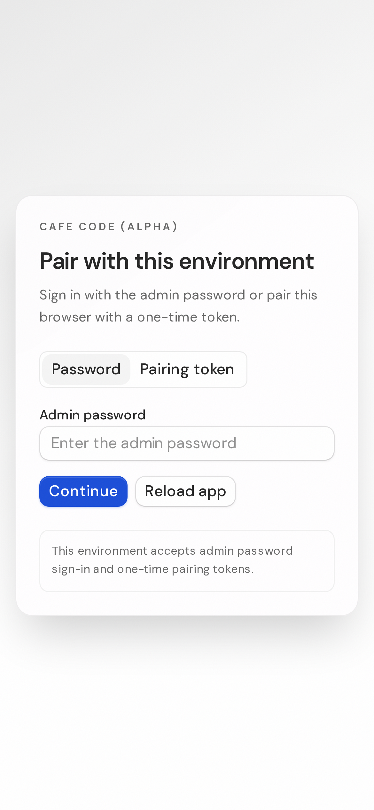 | 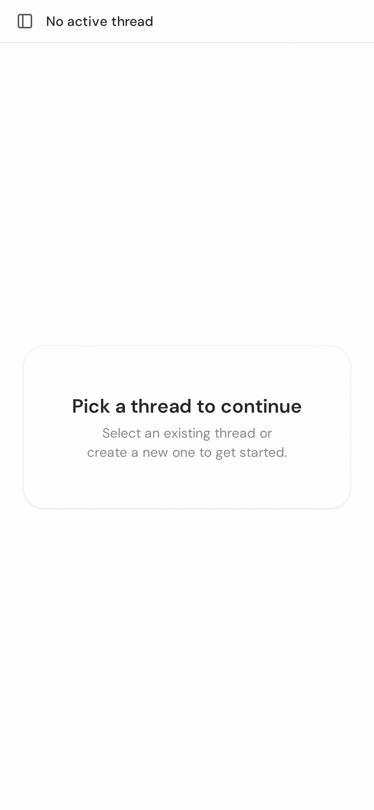 | 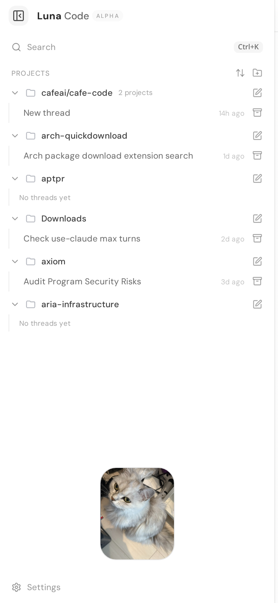 |

| Thread view (collapsed composer, F3)           | Expanded composer (F3)                                   | Model picker (F4)                             |
| ---------------------------------------------- | -------------------------------------------------------- | --------------------------------------------- |
| 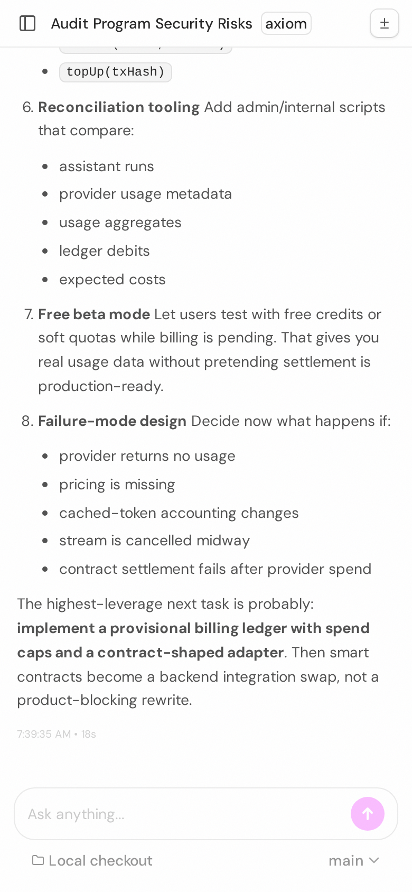 | 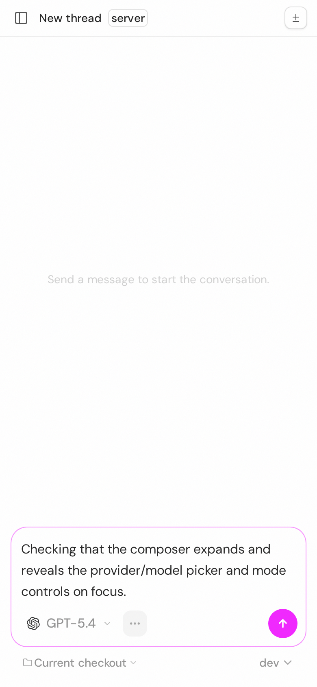 | 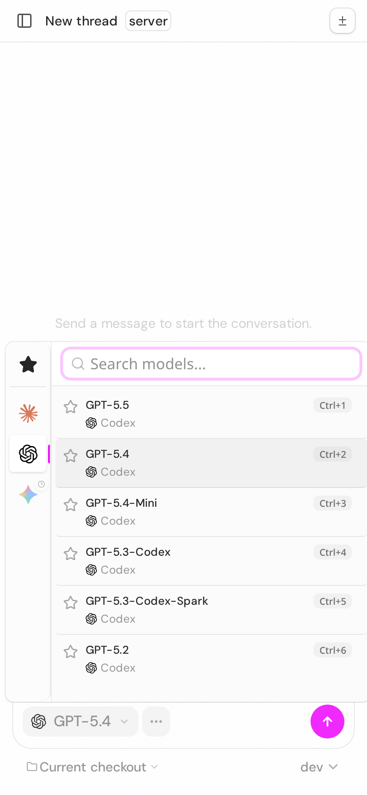 |

| Command palette (F4)                              | Settings nav Sheet (F7)                             | Diagnostics truncation (F5)                                 |
| ------------------------------------------------- | --------------------------------------------------- | ----------------------------------------------------------- |
| 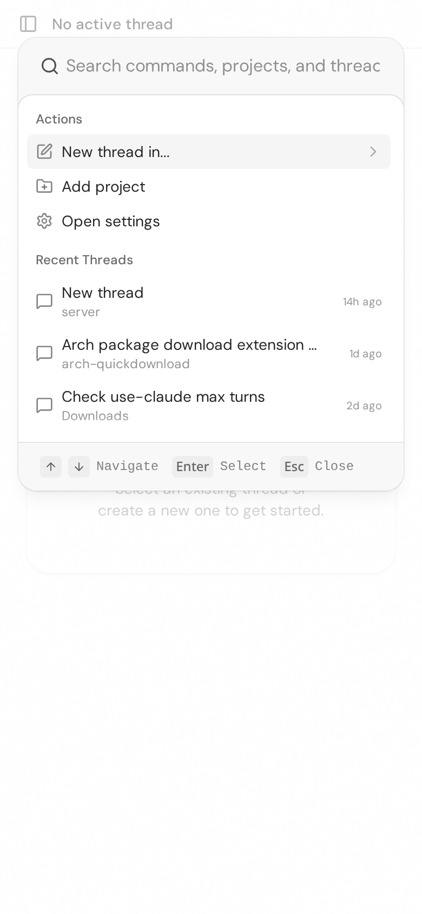 | 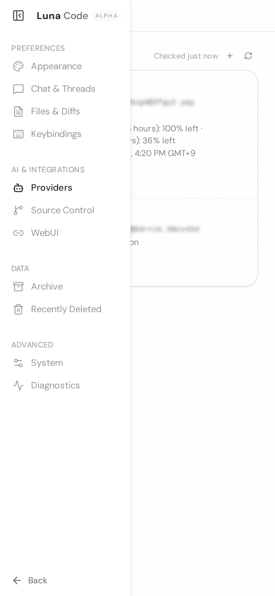 | 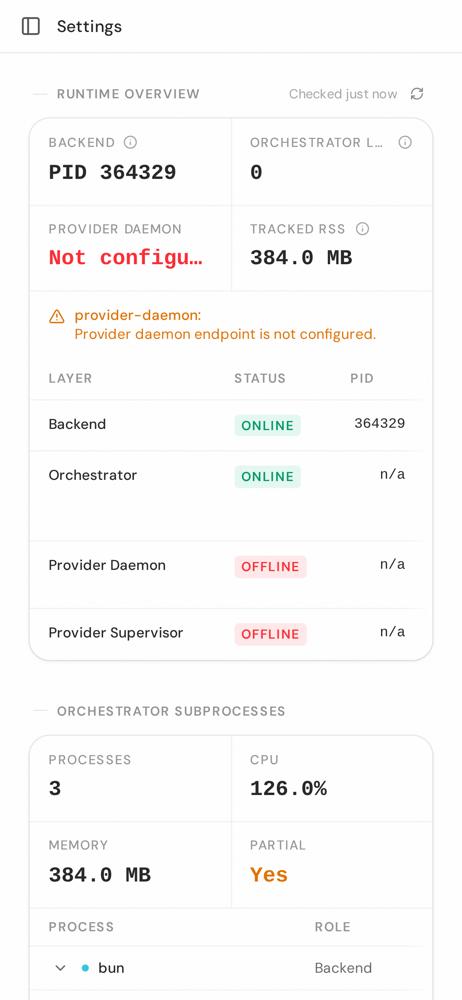 |

| Composer pinned above keyboard                   | Near-1:1 fold @768 (desktop layout, F1)    | Landscape 844×390                               |
| ------------------------------------------------ | ------------------------------------------ | ----------------------------------------------- |
| 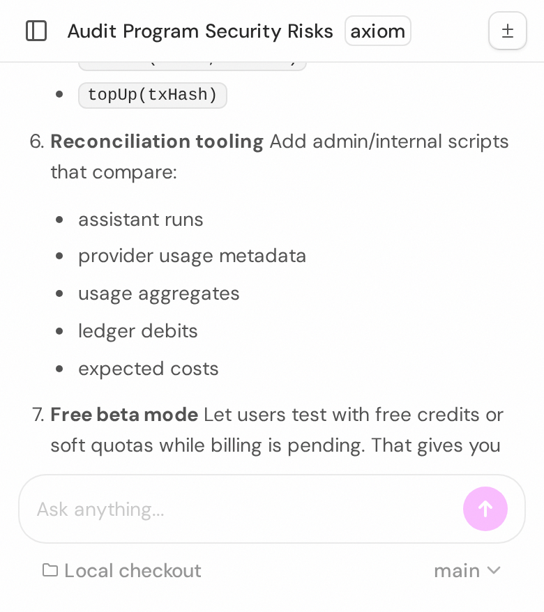 | 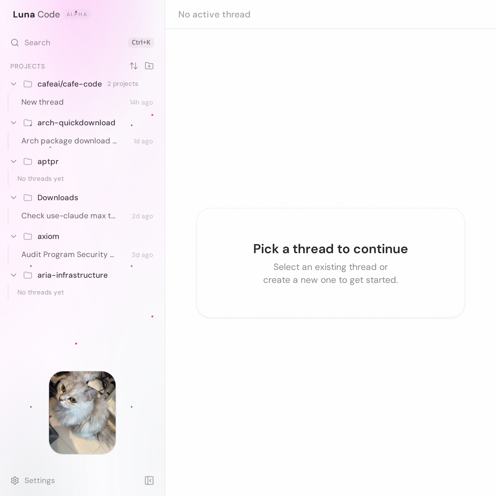 | 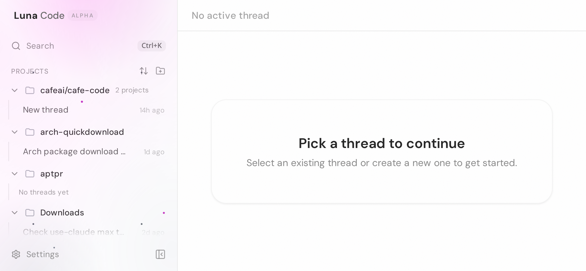 |

---

## 8. Implementation status — DONE & verified (2026-06-10)

All seven findings are implemented. Every change is gated to mobile widths
(`max-md:` / `max-sm:`) or to already-mobile-only runtime state, so the
desktop (≥ 768 px) render is untouched.

| #   | Change                                                                                                                                                                               | Files                                                                                                     |
| --- | ------------------------------------------------------------------------------------------------------------------------------------------------------------------------------------ | --------------------------------------------------------------------------------------------------------- |
| F1  | Mobile sidebar Sheet becomes a fixed ~20rem slide-over for the 640–767 px band (`sm:w-80`); phones (`max-sm`) keep near-full-bleed. Branch only renders `<md`.                       | `apps/web/src/components/ui/sidebar.tsx`                                                                  |
| F2  | Thread/project row actions are always-visible across the whole mobile range (`max-sm:`→`max-md:`) and get a larger `max-md:size-8` tap target; reserved padding widened to `max-md`. | `apps/web/src/components/Sidebar.tsx`                                                                     |
| F3  | Collapsed mobile composer now renders a tappable model/provider chip (wrapped in `data-chat-composer-collapsed-controls`).                                                           | `apps/web/src/components/chat/ChatComposer.tsx`                                                           |
| F4  | Command-palette footer hints and model-picker shortcut badges hidden on touch-only devices via `[@media(hover:none)_and_(pointer:coarse)]:hidden`.                                   | `apps/web/src/components/CommandPalette.tsx`, `apps/web/src/components/chat/ModelListRow.tsx`             |
| F5  | Diagnostics stat labels/values and the thread title wrap on mobile (`max-md:` overrides) while desktop keeps `truncate`.                                                             | `apps/web/src/components/settings/DiagnosticsSettings.tsx`, `apps/web/src/components/chat/ChatHeader.tsx` |
| F6  | Mobile drops the grow-spacer (`max-md:hidden`) so the mascot tucks under the project list instead of floating; padding trimmed. Desktop keeps bottom-anchor.                         | `apps/web/src/components/Sidebar.tsx`                                                                     |
| F7  | Resolved by construction: projects nav and settings nav share the same `Sidebar` component, so the F1 width rule applies uniformly.                                                  | —                                                                                                         |

### Verification (Playwright, rebuilt assets)

- `bun --filter @cafecode/web typecheck` ✓, `bun lint` (0 warnings/0 errors) ✓, `bun fmt` ✓.
- **Desktop unchanged** at 1280×800 and 768×768: layout matches the pre-change baseline; command-palette keyboard hints still shown on desktop (fine pointer). See `images/mobile-review/after/desktop1280-home.png`, `desktop768-home.png`, `desktop1280-thread.png`.
- **F1**: at 700×820 the sidebar opens as a ~320 px drawer over visible content (`after/fold700-sidebar-drawer.png`).
- **F2**: 10 always-visible row-action buttons on a touch context (were hover-only).
- **F3**: collapsed composer chip present (label "GPT-5.5"); tapping opens the picker (`after/phone390-thread-F3-collapsed.png`, `after/phone390-thread-F3-picker.png`). Note: tapping the chip also expands the composer (revealing the full control row) — benign, and never fires on desktop.
- **F4**: palette "Navigate" hint visible on desktop (true) and hidden on touch (false); model-picker rows show no `Ctrl+N` badge on touch (`after/phone390-palette-F4.png`).
- **F5**: "Not configured" renders in full on mobile (`after/phone390-diagnostics-F5.png`).
- **F6**: mascot tucked under the project list on mobile (`after/phone390-sidebar-F6.png`).

Before/after screenshots live in `images/mobile-review/` (before) and `images/mobile-review/after/`.
