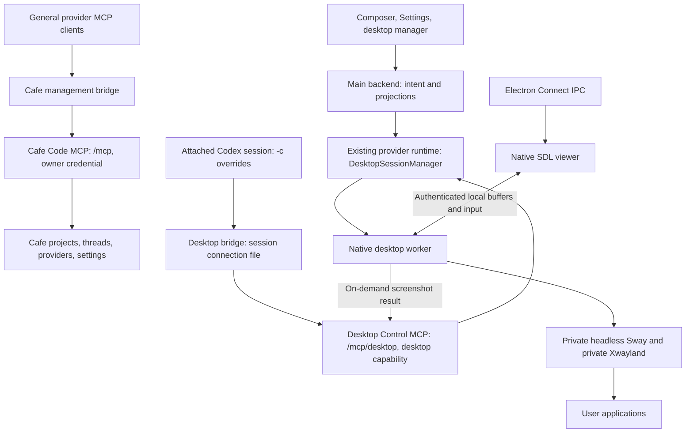

# Virtual desktops: implementation plan

Status: Linux/Codex implementation complete; broader hardware and long-run release qualification remains open  
Updated: 2026-09-08  
Initial desktop scope: Linux, private Sway sessions, native local viewer, session-scoped Desktop Control MCP; qualify Codex first

## Implementation record (2026-09-08)

The later UI revision consolidates the Virtual Desktops feature and Desktop Control MCP into one switch under Settings → MCP. The prior System setting is removed. The switch updates both stored compatibility flags together, and off-state cleanup lives in the same MCP section. A packaged Linux UI smoke with separate test settings passed enabling the switch, creating and renaming a real Sway desktop, showing it through the sidebar, opening the native viewer, disabling access, hiding the sidebar entry, and terminating the desktop from MCP settings.

Packaged conversation testing subsequently caught shared bundler chunks missing from copied MCP entrypoints. Both bridges now build independently with splitting disabled, and Linux CI tests each copied entrypoint outside `dist`. The corrected AppImage completed a real GPT-6-Astra conversation that opened a terminal running `btop`, observed it through Desktop Control, and reported its CPU heading. See the correction record in `virtual-desktop-compatibility.md` for the qualification scope.

The product, native runtime, separate Desktop Control MCP, and Codex adapter wiring below are implemented. The design sections retain their original rationale; the concrete decisions in this record supersede earlier proposed mechanisms. See [qualification results and commands](virtual-desktop-compatibility.md) for evidence, versions, and remaining hardware/soak work.

- The native viewer imports negotiated single-plane DMA-BUFs on compatible EGL drivers and uses sealed, uncompressed shared memory otherwise. Correct NVIDIA Wayland DMA-BUF pixels and X11 fallback pixels were tested. One outstanding frame request and unique published buffers replace the proposed reusable buffer pool. A 16 ms capture request cadence keeps static scenes fresh; damage-only capture is deferred. This is not a measured 60 fps guarantee.
- Capture uses pinned wlroots screencopy. A configurable scale-1 output (1280×800 by default, 320–2048 pixels per dimension) preserves screenshot-coordinate mapping; the tools expose full observations and explicit mutations. The catalog includes `observe`, `get_display`, `set_display`, `list_apps`, `launch`, `windows`, `focus`, `act`, `window`, `layout`, `workspaces`, `workspace`, `sway_query`, and `sway_command`; the server namespace supplies the desktop prefix. Window/container inspection retains workspace, parent, layout and visibility state. Structured tools cover common operations; raw Sway commands deliberately have full user desktop authority, including `exec` and `exit`, and return bounded per-command/partial-failure results without retries. After acting, the model explicitly observes to verify. Relative-pointer games and continuous gaming-key behavior are not qualified.
- SDL 3.4.14 is built statically from a verified official archive. The GLES2 viewer rebinds imported EGL images after SDL texture creation to avoid SDL clearing the borrowed image binding. Pixel tests caught and cover that behavior. Unsupported imports fall back without claiming zero-copy support.
- Unicode uses temporary private Wayland keymaps and a disposable XTest child for private Xwayland. Human takeover cancels that child and restores its keymap; the viewer retries only an explicit pre-execution busy result, never an uncertain input acknowledgement. The host clipboard is untouched.
- Migration 075 stores definitions and desired thread/draft attachments in side tables owned by the actual provider runtime. The existing future draft thread ID makes selection durable without rewriting historical orchestration events or submitting a message. Hard-deleted threads are fenced, abandoned drafts expire, and forks copy selection only. Termination retires attachments rather than substituting a desktop.
- Desktop commands use a separate authenticated daemon request path outside the replayable provider ledger. Mutations serialize, UI controls block duplicate in-flight intent, and transports never automatically replay input or launches. No durable input receipts or exactly-once input guarantee is introduced; uncertain outcomes require observation before an explicit retry. Observation history uses separately retained private PNG artifacts, never image bodies in the replay ledger.
- The detached provider daemon owns its existing `userdata` SQLite state. Inline provider mode uses the same manager; supervisor mode reports unsupported. Worker adoption verifies boot/PID birth and private capability handshake. Explicit Quit has an authenticated worker fallback when its daemon is unavailable. Watchdog recovery preserves desktops.
- Codex receives a complete per-root `-c` transport, `required=true`, and `default_tools_approval_mode="approve"` scoped only to `cafe-desktop`. `auto` can still prompt on destructive annotations; the explicit setting implements the user's no-approval desktop policy. Disabled/transient clients receive a valid disabled definition. Existing same-name registrations are rejected because TOML tables deep-merge.
- Real Codex 0.153.4 qualification resumed the same conversation to add Desktop Control, read a fresh screenshot-only code/colors, clicked and typed, preserved a prior conversation marker, then resumed without desktop tools. The dynamic-tool image-steer workaround is not used. Raw and canonical desktop tool activity is redacted, including nested resume snapshots.
- Linux AppImage packaging includes the helper outside ASAR and SDL/protocol license resources. The packaged runtime/backend/renderer/shutdown smoke passed. Native build dependencies are installed in CI; system Sway/Xwayland/D-Bus remain prerequisites, with actionable readiness checks rather than automatic root installation.

Implementation is present; representative Mesa hardware, device loss, broad real-profile/high-DPI/fullscreen application testing, measured frame latency, and a 16+ hour mixed workload remain release qualification. A short 60-second memory/descriptor soak passed and must not be represented as long-run qualification.

## 1. Decisions and scope

Build a persistent desktop that Cafe can attach to a coding conversation. Each desktop is a separate Sway compositor session with its own windows, workspaces, input seat, and display sockets. The user's existing desktop stays in place. The host can run Wayland or X11; applications inside the private desktop use Wayland or its private Xwayland instance.

Use a separate native viewer for the first release. Transfer local image buffers without a video codec, prefer GPU buffer import when compatible, and provide an uncompressed shared-memory fallback. Do not use VNC. Keep viewing independent of the compositor so closing a window does not stop the desktop or its applications.

Expose **two separate MCP servers**. `cafe-code` remains the existing Cafe management server, with its own on/off toggle and install/reinstall/remove controls for Codex, Claude Code, Grok, and OpenCode. `cafe-desktop` provides only desktop observation, app/window operations, and input. It has a separate switch, endpoint, catalog, and session credential. Turning either MCP off must not turn the other off.

Cafe-owned Codex sessions receive Desktop Control through structured `-c` launch overrides only when a desktop is attached and access is enabled. Supply the complete server definition, `enabled=true`, `required=true`, and `default_tools_approval_mode="approve"` together; do not install Desktop Control into the user's global Codex configuration as a side effect. Cafe already owns one app-server process per root conversation, making process-level configuration an appropriate initial boundary. Codex child agents share that root's authority; an MCP request alone does not identify an individual child. Keep desktop action admission pinned to the owning root turn. This supersedes both the original dynamic-tools design and the subsequent combined Cafe MCP proposal.

### Agreed product requirements

- An **MCP** settings tab contains separate Cafe Code and Desktop Control sections with independent switches.
- Cafe Code MCP has user-profile install buttons. Desktop Control is injected into attached Codex sessions and does not require a global provider install.
- Desktop Control's section appears only for a Linux backend. Other providers' general Cafe MCP installation does not imply desktop support.

- One Linux-only Desktop Control switch in Settings → MCP enables or disables Virtual Desktops and their AI tools together. No separate System toggle is required.
- A **Desktop** picker appears in the composer bottom controls beside Build/Plan and Goal.
- The picker selects a desktop and has a **+** action to create one.
- A **Virtual Desktops** destination appears near Atrium and Settings in the sidebar.
- That view lists active desktops and supports creation, **Connect**, rename, and termination.
- Connect opens an interactive local client window; browser viewing is not required.
- The AI can launch applications, inspect and switch windows, see screenshots, and use pointer and keyboard input.
- Each `observe` tool row opens its exact saved screenshot and capture metadata. Keep the last 50 observations across the environment by default, configurable in Desktop Control MCP settings to any nonnegative safe whole number; 0 clears and disables retention. Expired or unsaved calls explain why no image is available.
- Desktop actions run with the logged-in user's access, without Cafe per-action approval prompts.
- Use the user's real files and application profiles. Do not silently substitute demo profiles.
- Implementation was subsequently requested. Work begins at the compatibility gates below; unresolved gates must remain explicit.

### Proposed defaults used throughout this plan

These settle implementation details that were not individually specified in the conversation. They are recommendations, not claims that the user explicitly chose every default.

| Decision              | Initial behavior                                                                                                                     |
| --------------------- | ------------------------------------------------------------------------------------------------------------------------------------ |
| Feature default       | Disabled until enabled in Settings.                                                                                                  |
| Desktop MCP default   | Disabled; the single Desktop Control switch enables virtual desktops and AI access together, with a selected desktop still required. |
| Initial output        | One configurable output at scale 1, defaulting to 1280 × 800; viewer scaling remains independent.                                    |
| Desktop names         | Automatically allocate `Desktop 1`, `Desktop 2`, etc.; allow immediate inline rename.                                                |
| Attachment            | One selected desktop per Cafe thread, with an explicit `None` choice.                                                                |
| Sharing               | Multiple threads can reference a desktop, but only one thread controls it at a time.                                                 |
| Viewer ownership      | One interactive viewer per desktop; repeated Connect raises the existing window.                                                     |
| Closing the viewer    | Disconnect only. Apps and Codex work continue.                                                                                       |
| Disabling the feature | Revoke desktop control and prevent new creation; preserve running apps until explicitly terminated.                                  |
| App dependencies      | Discover supported system Sway/Xwayland installations initially; package the Cafe helper/viewer.                                     |
| Audio                 | No audio transport in the first viewer. Ordinary application audio may still use the user's audio session.                           |
| Browser surface       | Authenticated management can work against a Linux backend; interactive Connect requires the matching local Linux Electron client.    |

The runtime runs as the normal user, with the user's filesystem and network access. A private display is organization and input separation, not a VM or a security boundary. It does not make root privileges implicit, and it does not change unrelated Codex permission settings.

### Explicitly outside the first release

- Other operating-system desktop runtimes; full desktop qualification beyond Codex initially.
- A general plugin marketplace or installing provider applications themselves.
- Browser streaming, remote viewing, WebRTC, RDP, or VNC.
- Embedding live frames inside Electron as a release dependency.
- A replacement login session, display manager, or full desktop environment.
- Moving arbitrary already-running host windows into Sway.
- Filesystem/profile isolation, automatic profile cloning, or containers.
- Clipboard synchronization with the host, audio forwarding, multi-monitor support, and game-controller forwarding.
- A promise of gaming performance or universal game compatibility.

## 2. Evidence and existing integration points

The earlier dynamic-tool experiment found image visibility and resume-catalog limitations. The user chose MCP, so the new-conversation question and image-steer workaround are superseded alternatives, not pending approval gates. See [measured compatibility results](virtual-desktop-compatibility.md). The MCP bridge has deterministic image tests, isolated CLI checks, and live model screenshot/input/resume qualification; broader application tasks remain a release gate.

This plan was checked against the repository on 2026-09-08. File references below identify existing integration points; proposed files are marked as new.

| Existing area                                                                                                                                              | Evidence and consequence                                                                                                                                                          |
| ---------------------------------------------------------------------------------------------------------------------------------------------------------- | --------------------------------------------------------------------------------------------------------------------------------------------------------------------------------- |
| [ChatComposer](../apps/web/src/components/chat/ChatComposer.tsx)                                                                                           | Owns bottom Build/Plan and Goal controls. Add a separate Desktop control without changing mode selection.                                                                         |
| [CompactComposerControlsMenu](../apps/web/src/components/chat/CompactComposerControlsMenu.tsx)                                                             | The compact composer has a separate controls menu; it needs the same desktop behavior.                                                                                            |
| [SidebarFooterNavigation](../apps/web/src/components/SidebarFooterNavigation.tsx)                                                                          | Owns the Atrium/Settings destinations. Add the gated management destination here and wire it through the sidebar.                                                                 |
| [Settings contracts](../packages/contracts/src/settings.ts)                                                                                                | Settings have full schemas, defaults, and patch schemas. The enable flag affects backend execution, so use a server setting rather than renderer-local state.                     |
| [Orchestration contracts](../packages/contracts/src/orchestration.ts)                                                                                      | Migration 075 stores authoritative desired desktop attachments under actual/future thread IDs.                                                                                    |
| [DesktopBridge](../packages/contracts/src/ipc.ts), [desktop IPC](../apps/desktop/src/ipc/DesktopIpcHandlers.ts), [preload](../apps/desktop/src/preload.ts) | Provide a typed local Connect path with existing sender validation.                                                                                                               |
| [CodexSessionRuntime](../apps/server/src/provider/Layers/CodexSessionRuntime.ts)                                                                           | Builds structured app-server arguments; desktop tools use native MCP handling, without an `item/tool/call` callback.                                                              |
| [CodexAdapter](../apps/server/src/provider/Layers/CodexAdapter.ts)                                                                                         | Creates a separate runtime scope/app-server per root Cafe thread. Inject desktop MCP configuration at that boundary; child agents inherit the root's authority.                   |
| [CodexSessionRuntime](../apps/server/src/provider/Layers/CodexSessionRuntime.ts)                                                                           | `buildCodexAppServerArgs` already builds structured `-c` overrides. Preserve the shared provider policy while adding only this session's desktop definition.                      |
| [Generated Codex schemas](../packages/effect-codex-app-server/src/_generated/schema.gen.ts)                                                                | Pinned official MCP configuration/refresh protocol. Experimental dynamic-tool types remain historical compatibility evidence.                                                     |
| [Protocol generator](../packages/effect-codex-app-server/scripts/generate.ts)                                                                              | Pinned to Codex 0.153.4, upstream commit `3d2ee51ca2d5db578f328aa75e20aa22c0197c9a`. Do not use an older assumed target or hand-edit generated output.                            |
| [ProviderDaemonRuntime](../apps/server/src/providerDaemon/ProviderDaemonRuntime.ts)                                                                        | The detached provider runtime is the existing home for long-running adapters. Desktop tool execution must survive main-backend and renderer reconnects.                           |
| [RemoteProviderService](../apps/server/src/providerDaemon/RemoteProviderService.ts), [CommandLedger](../apps/server/src/providerDaemon/CommandLedger.ts)   | Existing authenticated process routing and command identity should guide desktop control. Do not journal screenshot bodies or replay physical input through a generic retry path. |
| [Migrations](../apps/server/src/persistence/Migrations.ts), [projector](../apps/server/src/orchestration/projector.ts)                                     | Add explicit migrations and projection support; renderer-only attachment state is insufficient.                                                                                   |
| [DesktopProcessReaper](../apps/desktop/src/backend/DesktopProcessReaper.ts), [killall](../apps/server/src/cli/killall.ts)                                  | Must distinguish recoverable backend restarts from explicit termination of Cafe-owned desktop processes.                                                                          |

OpenAI documents single-run `-c` overrides, TOML values, and dotted MCP settings. Isolated Codex 0.153.4 checks verified both enabling a disabled definition for one invocation and supplying a complete temporary definition, while leaving `config.toml` unchanged. This establishes configuration behavior, not model-visible tools or resume behavior. Creation-time dynamic-tool behavior remains historical evidence. [Configuration overrides](https://learn.chatgpt.com/docs/config-file/config-advanced#one-off-overrides-from-the-cli), [MCP documentation](https://learn.chatgpt.com/docs/extend/mcp?surface=cli), [app-server documentation](https://learn.chatgpt.com/docs/app-server).

The repository's generated tool specification supports function and namespace variants, and tool results support `inputText` and `inputImage`. Implement against those actual types after verifying what the binary accepts; do not copy an older untyped example.

SDL provides a host-window foundation for both Linux display systems. Sway IPC provides a separate window/workspace control plane. These are the reasons to use a native viewer and one private compositor implementation. [SDL Linux support](https://wiki.libsdl.org/SDL3/README-linux), [SDL Wayland support](https://wiki.libsdl.org/SDL3/README-wayland), [Sway IPC](https://man.archlinux.org/man/sway-ipc.7.en)

## 3. UI behavior

### 3.1 Settings

**Cafe Code MCP (implemented):** The `/mcp` endpoint and `mcpEnabled` flag stay on by default to preserve existing authenticated MCP and Grok behavior. Its switch affects only Cafe management calls. Installation requires a matching local desktop connection, preserves provider config, contains no bearer secrets, and never changes approval settings. Providers may require MCP reload/restart after registration. The installer covers default user profiles, including both Claude default config locations; custom homes remain separate. Platform-specific restrictions live in AGENTS.md.

**Desktop Control MCP (implemented, Linux-only):** A second section in Settings → MCP has one Desktop Control switch, default off. It persists `desktopControlMcpEnabled` and `virtualDesktopsEnabled` together in one settings request, independent of the Cafe Code MCP switch. Explain that selecting a Desktop attaches its tools to that Codex conversation. Show whether desktop prerequisites are ready and how many sessions currently have access. Do not show global install buttons or claim other providers are qualified. This switch revokes desktop tool admission and closes viewers immediately when turned off; running apps remain available for explicit termination in the same section. Enabling it makes eligible bindings available at the next idle session boundary. Cafe management tools remain governed solely by their own switch.

**Virtual Desktops (implemented; see implementation record):**

Keep enablement and saved-screenshot preferences in the **Desktop control** section of Settings → MCP, with a summary and link to the shared Desktops manager. Its single **Enable Desktop Control MCP** toggle controls feature visibility and AI tools together; System settings has no duplicate toggle.

**Saved observations (implemented):** The same section includes a number field and Save button backed by `desktopObservationRetention`, default 50. Reducing it expires the oldest captures; 0 also disables new saves. This limit covers all desktops and conversations in that environment. Retention changes do not restart Codex or alter desktop access. Store immutable PNG files separately from the transcript with private permissions and migration 076 metadata/intents. Keep only a validated `structuredContent.desktopObservation` reference on the exact tool item. Lazy owner-authenticated screenshots expand inline in the work log using the active thread's exact environment and release their blob URLs on collapse. Clicking the small image opens full-resolution viewing with a fit/actual-size toggle. Hard thread deletion revokes capture retrieval and queues file cleanup; pending writes cannot resurrect deleted captures. Old calls made before saving was supported cannot be restored.

Retain both desktop flags in backend `ServerSettings` for decoding compatibility, with defaults of `false`; the single MCP UI switch updates both atomically and reads on only when both are true. Each backend owns its own value. Do not synchronize it across saved environments through browser storage or desktop bootstrap settings.

Report capability separately from preference. Enabling the preference does not claim that Sway, capture, GPU import, or desktop MCP bindings are ready. Show a bounded readiness summary and actionable prerequisite diagnostics in this section. Run checks on demand and cache the result; do not launch compositor probes on every settings subscription or renderer reconnect.

Turning the toggle off immediately stops admission of new desktop actions, releases pressed input, and disconnects viewer control. Do not terminate applications as a side effect of a settings toggle. Hide the normal picker/sidebar entry, but retain a running-desktop summary and management/termination controls inside this MCP section so preserved desktops are not stranded. Re-enabling reconciles those same sessions.

Termination is an explicit user action with nearby text explaining that it closes apps. Do not add a per-action confirmation dialog or approval queue. A `Terminating…` state prevents accidental duplicate dispatch.

### 3.2 Composer picker

The normal control reads **Desktop** with a monitor icon, matches Goal typography and sits immediately to its right. It shows the selected name and keeps a pending Next turn badge visible when attached. Its menu provides Open desktop and Manage desktops alongside selection. Opening it shows:

1. `None` to detach the conversation.
2. Available desktops with name and authoritative state.
3. A `+ New desktop` action.

Creating from this picker starts a desktop and selects it for this conversation after creation succeeds. Creating from the management view does not attach it to whichever conversation happens to be open.

Preserve the association on reload, provider reconnection, and thread resume. Rename propagates to every picker without changing the opaque ID. Termination retires attachments; never silently create another desktop with the same ID/name.

Desktop selection is independent of Build/Plan, Goal, and the chosen model. Do not silently change those controls. Existing Plan behavior and provider permissions remain explicit; enabling desktop tools does not rewrite them. When the combined Desktop Control switch is off, preserve the attachment and running apps but hide the normal picker/sidebar entry and close viewer access. Cleanup remains in MCP settings.

On a running turn, a different selection is stored for the next turn and labeled “Next turn.” The active turn retains its original desktop and incarnation. `None` follows the same rule; immediate revocation is available through disabling the feature, termination, or human takeover. Do not claim that a pending selection has retargeted an executing model action.

In an unsent draft, persist selection under the existing preallocated future thread ID, which is reused by actual thread creation. Creating a desktop must not implicitly submit a message.

Expose the control only when the current backend supports Linux desktops and the conversation uses a qualified Codex instance. Other providers continue working normally without desktop tools. Keep management independent of the selected conversation's provider.

Support keyboard navigation, clear focus restoration, long names, empty/loading/error states, and the compact composer menu. Use one picker component/state source for both composer layouts.

### 3.3 Virtual Desktops management view

Add a sidebar destination beside Atrium and Settings. Use Cafe's existing app-level navigation patterns and a dedicated view; do not put the manager in an individual thread timeline.

Each desktop card shows its image preview, name, state and controlling conversation, with **Open desktop** as its primary action. Rename, Display settings, End desktop and technical details live in its overflow menu. **New desktop** opens the same name-and-resolution dialog in the manager and picker. Show a static screenshot preview on each desktop card. Capture only visible cards on open or explicit refresh, with two encoder children maximum and a 480px / 512 KiB bound. Do not stream thumbnails or persist these owner-only previews in conversation history.

Visible states cover starting, ready, reconnecting, ending and cleanup failures. Stopped is only a durable internal cleanup marker; successfully ended sessions are removed immediately with their attachments. Failed cleanup remains retryable until verified removal.

Renaming is inline and has a length bound. Display names never become socket paths, shell commands, or process identifiers. Connect is disabled while startup/reconciliation is incomplete. A viewer failure is shown separately from desktop/application failure.

### 3.4 Viewer and human control

Connect opens or raises a native window titled `Cafe — <desktop name>`. It contains the desktop surface and a small connection/control indicator. Closing it disconnects without changing thread attachment or desktop lifecycle.

Use two input-owner states: AI and human. Merely opening the viewer does not interrupt the AI. Only the viewer's explicit Take control button requests human ownership; wait for its acknowledgment before forwarding guest input. Hover, motion, window movement and guest input while watching never take ownership. Finish or cancel the current atomic input operation, release held input, then give subsequent human input priority. AI control calls receive a structured `human_control_active` result instead of silently fighting the user.

Provide a small **Return to Codex** action. The active agent can explicitly call `take_control` to reclaim ownership, cancelling held human input and publishing the owner change immediately; require a fresh observation before its next mutation. Reject viewer input from the old ownership epoch. Closing the viewer also releases human ownership. This is input coordination, not action approval. Viewer chrome shortcuts and host focus-loss handling must not accidentally type into the guest.

When capture or the connection actually fails, cover or clearly mark the retained frame as disconnected/stalled and stop admitting clicks against it. A desktop with no pixel changes is valid; a static scene is not itself a stalled connection.

### 3.5 Platform and environment boundaries

Use authoritative backend capabilities for the Linux runtime gate. Use explicit local desktop capability plus matching environment identity for Connect. Renderer user-agent detection and the mere presence of `window.desktop` are insufficient authorization.

A browser connected to a Linux backend can manage that backend's desktops through authenticated APIs, but has no interactive Connect action. A saved remote environment must never open a same-named desktop on the local machine. Initial local viewing supports only the desktop client's own primary local backend.

Unsupported backends must decode the new setting and nullable attachment safely while keeping the feature unavailable. Do not load Linux native dependencies on other platforms.

## 4. Runtime architecture and ownership



The diagram shows ownership boundaries, not a requirement to tunnel every image through the Node manager. GPU buffers go directly between native processes. Codex receives encoded screenshots only when its tools request them.

### 4.1 Main backend

- Own persisted desktop definitions, thread attachment intent, settings, and renderer projections.
- Send lifecycle commands to one desktop service in the environment's provider runtime.
- Subscribe to bounded lifecycle/status events and reconcile after reconnect.
- Never own compositor lifetime through a WebSocket request scope or React component.
- Keep ordinary coding usable when this feature is disabled or unavailable.

### 4.2 DesktopSessionManager in the existing provider runtime

Add one environment-scoped service, shared by all Codex instances and desktop-management requests. Host it beside the adapters in the existing detached provider runtime, outside any individual Codex session's scope. Do not start a second competing manager in the main backend or per provider instance.

The service owns worker startup/adoption, capabilities, runtime generations, action admission, per-desktop control leases, and bounded status. It preserves desktops when the renderer or backend disconnects. MCP calls require the main backend; the bridge follows its current address after restart. Never silently retry an action whose response was lost. Add desktop RPCs to the existing authenticated runtime boundary without treating arbitrary input as replayable provider commands.

Local provider mode uses the same service implementation in its actual runtime process. If the explicit provider-supervisor topology is enabled, route to one actual owner; do not construct managers on both sides. Qualify that path before advertising it, or report desktop execution unsupported for that topology while preserving normal provider work.

### 4.3 Native worker and viewer

Use a small Linux native component with distinct worker and viewer roles. The worker maintains the private Wayland connection, capture, input devices, and compositor/application lifetime. The viewer owns only a host window, buffer presentation, and human input forwarding.

Recommended initial implementation: a C++ helper/viewer using Wayland client APIs, EGL where applicable, and SDL3 for the viewer window/input. Use a shared native protocol module for worker/viewer messages. Keep business rules, orchestration, settings, and provider integration in TypeScript/Effect. Confirm the native build/dependency choice during the first viewer spike before adding a build workspace.

Use structured framed messages over private Unix sockets for control and proper file-descriptor passing for GPU/shared-memory buffers. An integer file descriptor serialized in JSON is not a transferable buffer. Bootstrap credentials through inherited private descriptors or private files, never process arguments.

The worker is the owner of its compositor and private session bus. It must remain available for adoption when a manager process restarts, with authenticated ownership transfer and a process-incarnation check. A dead manager must not cause two new compositors to replace one healthy session. An unauthenticated or inconclusive health read is not permission to kill a live worker.

### 4.4 Lifecycle contract

| Event                                | Required result                                                                                   |
| ------------------------------------ | ------------------------------------------------------------------------------------------------- |
| Renderer reload or browser reconnect | Rehydrate metadata; no new compositor.                                                            |
| Main backend restart                 | Provider runtime and worker continue; recover subscriptions and attachment state.                 |
| Viewer close/crash                   | Release input ownership and buffer references; desktop and apps continue.                         |
| Codex interruption/crash             | Cancel its pending actions and release input; preserve the desktop.                               |
| Provider runtime restart             | Adopt authenticated surviving workers; invalidate old tool leases and uncertain actions.          |
| Sway or worker failure               | Mark the incarnation failed, clean up its owned processes, and retain an actionable reason.       |
| Explicit Terminate                   | Revoke control, stop viewer access, close apps/compositor/session bus, then confirm process exit. |
| Cafe background/detached operation   | Follow existing process-lifecycle policy; closing the UI is not an implicit desktop termination.  |
| Explicit quit-and-stop or `killall`  | Include owned desktop workers and apps in the existing explicit cleanup path.                     |
| Machine restart                      | Remove ended incarnations and their selections after safe cleanup; preserve new-desktop defaults. |

Termination must use verified ownership and process groups or a supported user-session containment mechanism. Sway tree PIDs alone are insufficient: an app can spawn helpers, detach, or never create a window. Qualify cleanup with forking applications; do not claim complete process cleanup from one `kill(swayPid)` call. Never reap unrelated host processes by application name.

Use bounded graceful shutdown followed by forced cleanup of the owned group, with bounded waits for observed exit. Never tie worker lifetime to inherited Electron stdout/stderr pipes. Give the worker bounded, redacted diagnostics consistent with existing detached-runtime logging.

## 5. Sway sessions and launching applications

Create a private compositor configuration and per-desktop runtime directory with restrictive permissions. Start Sway with a headless backend, a supported GPU renderer when available, one output, and a private Xwayland display for X11 applications. Discover display sockets and output identity from actual startup results; do not hard-code `wayland-1`, `:1`, or an output name.

Do not install Sway as the user's default login session or modify their existing Sway/KDE/GNOME configuration. Keep the existing host's environment unchanged. Headless backend support and renderer behavior must be checked against the installed Sway/wlroots versions, not inferred from the host display protocol.

Launch applications with explicit private `WAYLAND_DISPLAY`, `DISPLAY`, `SWAYSOCK`, and session-bus context, preserving the user's HOME, files, executable discovery, and intended audio access. If a private runtime directory is used, route required host audio/session services deliberately rather than inheriting a broken or accidental mixture. Never run global desktop-environment import commands that retarget the user's host services.

The native worker now updates its private D-Bus activation environment after Sway publishes its display addresses. A separate, worker-owned Secret Service bridge reserves `org.freedesktop.secrets` before app launches and routes that API to the inherited same-user host bus with one upstream connection per private client. Other service traffic stays private. Host credential prompts remain on the host display; direct KWallet APIs are outside this bridge. A transient runtime service entry restarts the bridge instead of activating a second keyring process. Credential bodies are neither logged nor persisted, and missing host services fail without a storage fallback. Existing workers need restarting to acquire this setup.

Provide app discovery from desktop entries and an explicit executable-plus-argument launch form for tools such as a terminal running `btop`. Parse desktop-entry field codes and launch semantics correctly; do not split `Exec` on spaces or interpolate names into a shell. The terminal choice uses the user's available/default terminal where practical. A particular terminal emulator or screenshot CLI is not a required architecture dependency.

Use Sway IPC for output/workspace/window inventory, focus, and deterministic window selection. Track stable container IDs plus the desktop incarnation. Support both native app IDs and Xwayland window metadata. A visible title is a label, not a unique identity. [Sway IPC operations and event subscription](https://man.archlinux.org/man/sway-ipc.7.en)

Launching an executable is not proof that its window opened inside Sway. Watch process and window events and return whether it became visible, exited, timed out, or appears to have delegated elsewhere. Avoid indefinite launch waits for background programs.

Real application profiles have real single-instance behavior. A browser already using its profile on the host may reuse its host process or refuse another launch. A private session bus does not remove filesystem locks or every application-specific singleton mechanism. Report that case explicitly. Do not silently copy a profile, kill the host browser, or claim its host window moved into Sway.

## 6. Capture, presentation, and input

### 6.1 Shared capture service

Use one worker-owned output/capture service for both model observation and viewer frames. This gives both clients the same output identity, geometry, cursor policy, and compositor state while allowing different frame rates and encodings.

Negotiate the capture protocols that the actual compositor advertises. Prefer a current image-copy capture path where available; qualify a wlroots screencopy path when needed. The protocol describes image acquisition, not a guarantee that a particular GPU buffer format/modifier can be imported by the viewer. [Image-copy capture protocol](https://wayland.app/protocols/ext-image-copy-capture-v1)

Capture nothing continuously when no viewer or tool request needs it. With a viewer open, use damage-aware capture, bounded buffering, and latest-frame presentation. A static desktop may produce no new damaged frame; track connection health independently from pixel changes.

### 6.2 GPU path and fallback

The preferred path exports/imports supported DMA-BUF buffers using actual format, plane, stride, offset, modifier, device, and synchronization metadata. Negotiate import compatibility and synchronization; wait for producer completion and release each buffer only after the consumer has finished using it. Handle unsupported modifiers, multiple GPUs, resize, device loss, and viewer disconnect without corrupting frames or leaking descriptors.

When import fails, use an uncompressed shared-memory path. The compositor may still render on the GPU even though capture requires readback and a viewer upload. Report compositor renderer and viewer transfer mode separately; a GPU-rendered Sway session is not proof of a zero-copy viewer.

Keep a small bounded frame pool, initially two or three in-flight buffers. Drop superseded preview frames instead of accumulating playback latency. This is local pixel transport, not video streaming; no codec, bitrate negotiation, or lossy quality slider is required.

The first performance gate is measured on the user's NVIDIA system, then on representative Mesa hardware. Success on one driver is not universal compatibility. A correct shared-memory fallback is required; an unproven zero-copy claim is not a release criterion.

### 6.3 Viewer geometry and freshness

Keep the virtual output resolution stable when the viewer is resized. Scale or letterbox in the viewer, and invert that exact transform for input. SDL window coordinates and drawable pixel dimensions can differ on high-DPI displays. Map through the actual drawable geometry and output transform, and ignore clicks in letterbox margins. [SDL window sizing and pixel-density behavior](https://wiki.libsdl.org/SDL3/SDL_CreateWindow)

Maintain distinct fields for desktop incarnation, output generation, dimensions/scale/transform, frame sequence, capture completion, presentation time, and transport health. Use monotonic time for local deadlines. Do not label the last retained image “live” after capture disconnects.

Define one cursor-compositing policy. Support compositor cursors and application-rendered cursors without doubling either. Test hotspots, scaling, pointer confinement/relative mode, fullscreen changes, and focus transitions. If pointer-lock behavior cannot be supported correctly initially, expose a clear capability limitation rather than delivering misleading clicks.

### 6.4 Input service

Use Wayland virtual pointer and virtual keyboard support against the private compositor, plus Sway IPC for window/workspace focus. Human and AI input must share this service, so their coordinate and button semantics cannot diverge. [Virtual pointer protocol](https://wayland.app/protocols/wlr-virtual-pointer-unstable-v1), [Virtual keyboard protocol](https://wayland.app/protocols/virtual-keyboard-unstable-v1)

Track pressed buttons/modifiers/keys explicitly. Release them on cancellation, owner handoff, viewer focus loss/disconnect, and desktop termination. Flush events in the required protocol order, including pointer frames. Keep cancellation responsive during drag, repeat, scroll, and text entry.

Text insertion needs a real design beyond ASCII keycodes. Qualify Unicode keymap generation or a private-desktop clipboard/paste path, without reading or replacing the host clipboard. Separate text insertion from physical key chords and test non-US layouts, multiline text, and modifier restoration.

Input delivery acknowledgment is not proof that the application acted on it. After a tool action, collect a bounded observation and report any uncertainty. Never silently retry a click, key sequence, or text insertion merely because a new frame did not arrive.

### 6.5 Why embedding is deferred

Electron exposes experimental shared-texture import and Linux native-pixmap structures. It may eventually support an embedded viewer, but it adds another buffer-lifetime/renderer boundary that the first implementation does not need. Keep the worker protocol reusable, and qualify embedding separately after the native viewer works. [Electron shared textures](https://www.electronjs.org/docs/latest/api/shared-texture), [Linux texture handles](https://www.electronjs.org/docs/latest/api/structures/shared-texture-handle)

## 7. Separate MCP servers and Codex session integration

### 7.1 Cafe Code registration and local bridge (implemented)

Keep the existing authenticated stateless Streamable HTTP endpoint, `POST /mcp`, limited to Cafe management. Its `mcpEnabled` server setting is checked on every request. Unauthenticated and non-owner requests remain rejected even on loopback. Off rejects new Cafe management calls without pretending to undo earlier mutations. Do not register any `desktop_*` tools here.

Settings → MCP installs a secret-free stdio definition named `cafe-code` into each supported provider's default user config. Codex and Grok use TOML, Claude uses its user JSON, and Cafe's pinned OpenCode uses its JSON/JSONC MCP map. Preserve unrelated values and comments, reject conflicting registrations, detect edited registrations, and support removal. Do not launch providers, interrupt turns, change permission policies, or install provider binaries as a side effect.

The copied standalone Node bridge runs through Cafe's existing executable. For AppImages, use the stable AppImage executable rather than a transient mount path. Configuration contains the command, structured arguments, and non-secret environment. The backend writes its current loopback URL and owner credential to a private file. The bridge rereads that file per call, refuses redirects and non-loopback targets, bounds input/output and concurrent requests, and never logs payloads or retries mutations.

One backend-scoped manager serializes installs and survives renderer disconnects. The backend reuses valid credentials across restarts, renews before expiry, and publishes changes atomically. Old credentials expire normally so already-dispatched requests can finish. Remove unregisters only `cafe-code`; active provider processes can require reload. Off is the immediate Cafe management request gate.

### 7.2 Desktop Control server and scoped bridge (implemented; see implementation record)

Add a separate stateless MCP server named `cafe-desktop` at `POST /mcp/desktop`, exposing only the desktop catalog below. Accept only directly observed loopback transports; forwarded headers do not establish locality. Check `desktopControlMcpEnabled`, `virtualDesktopsEnabled`, the Linux runtime capability, and the session binding on every request. Never consult `mcpEnabled` to admit desktop calls. Turning the combined Desktop Control switch off releases pressed input, revokes queued actions, and closes viewers while desktop applications continue. The runtime still accepts the two legacy fields independently; normal UI actions update both together.

Use a dedicated desktop capability issuer/validator and private per-session connection file. A general Cafe owner bearer is not a desktop capability, and a desktop capability must not authenticate to Cafe management or other owner APIs. The current `ProviderMcpCredentialBroker` issues owner sessions for Grok's Cafe management connection; do not reuse those tokens as desktop credentials. Share low-level private-file/framing utilities where appropriate, keeping server identity and credential audiences explicit.

A dedicated desktop bridge entrypoint must accept only its own connection format and exact `/mcp/desktop` loopback target. The existing Cafe bridge remains pinned to `/mcp`; do not widen it to accept either endpoint from an arbitrary connection file. Package both entrypoints but reuse their bounded transport implementation. Both endpoints can share the main backend HTTP listener; two MCP identities do not require two backend processes, two Sway sessions, or duplicated native lifecycle code.

Desktop credentials map to an exact Cafe environment, root thread, provider-session generation, and desktop binding/incarnation. Validate that mapping in the authoritative runtime, then capture the active root-turn lease before admitting an action. Missing, revoked, idle, or stale bindings fail explicitly. Never infer identity from the focused conversation or model-supplied IDs. Requests already admitted retain their original lease through completion; queued requests cannot jump to a new binding.

### 7.3 Codex `-c` injection and conversation continuity (implemented; see implementation record)

For an attached, enabled Codex session, add a full TOML server definition to the existing structured app-server argument builder. The conceptual argv is:

```text
codex app-server
  -c 'mcp_servers.cafe-desktop={command="<Cafe executable>",args=["<desktop bridge>","<private session connection file>"],env={ELECTRON_RUN_AS_NODE="1"},enabled=true}'
```

The quotes above illustrate a shell invocation. Production uses an argument array and a TOML encoder, without a shell or interpolated shell command. Only the connection-file path goes in argv, never a credential. No user/project TOML write, `codex mcp add`, or global `-c` provider setting is needed. Preserve all unrelated MCP definitions and existing concurrency/transport overrides.

The user's shorter form, `-c mcp_servers.cafe-desktop.enabled=true`, also works when a valid definition already exists. Codex 0.153.4 rejects a lone `enabled` field without a transport, even when false. Prefer complete session injection so Cafe does not depend on a global desktop install. For detached/disabled sessions, use a valid disabled managed definition. No credential or bridge child is created for a session without desktop access. Apply the same suppression to transient history/status helper processes so they cannot accidentally start desktop control.

Preflight the effective configuration for a same-name definition, including trusted project layers. CLI overrides merge with inherited tables: an isolated 0.153.4 check found that injecting a stdio definition over an HTTP definition retains the old `url` and fails bootstrap. A full inline table is not a table-deletion operation. Admit a missing entry or a verified compatible Cafe-managed stdio entry; report an unmanaged/incompatible entry as a configuration conflict. Do not overwrite unrelated global config, carry an unknown command/environment into the session, or claim desktop readiness after a failed merge. Test both enabled and disabled injection against these cases when implementing the runtime path.

`-c` is process-start configuration; it does not hot-toggle a running app-server. Cafe's current adapter creates one app-server per root conversation. Preserve that isolation: never move desktop flags into provider-instance defaults or a shared multi-root app-server. The root and its native child agents share the process connection and the root's single desktop/control lease. MCP does not attest which child called; do not promise child-level isolation. Unrelated Cafe roots receive separate connections and credentials.

At an idle boundary, attaching/detaching or changing the selected desktop reconciles the provider process configuration and its credential as one lifecycle operation, then resumes the **same native Codex thread ID**. A process replacement uses the existing authoritative stop/resume boundary; do not run two live copies of the same native thread to stage a candidate. Keep the selection pending if reconciliation fails, report it, and do not start the next turn with unintended desktop access. A change during an active turn waits for the next turn; an explicit off switch revokes server-side access immediately even while the old catalog is still loaded.

On replacement, revoke the old desktop capability and retire its bridge before admitting a new binding. Do not rewrite an old session's connection file to point at a new desktop or session generation. Native history and the private Sway desktop survive provider replacement. Keep the finite 64 MiB reader and bounded resume pagination. Qualify new-thread and existing-thread discovery, identity/history preservation, concurrent enabled/disabled sessions, cancellation, and stale-client rejection against the pinned binary. An eventual supported MCP reload can avoid process replacement only after it proves these same properties.

Claude/Grok/OpenCode Cafe management installers remain available. Their desktop session injection is outside initial qualification. A manually launched provider needs an explicit desktop binding design before offering a Desktop Control install button; a generic user-level MCP registration cannot supply the active Cafe thread or turn.

### 7.4 Model-visible desktop tools (implemented; see implementation record)

| Tool                | Purpose                                    | Required behavior                                                                                          |
| ------------------- | ------------------------------------------ | ---------------------------------------------------------------------------------------------------------- |
| `desktop_observe`   | View the selected desktop or crop          | A real image plus frame ID, output geometry, focus, and bounded freshness metadata.                        |
| `desktop_list_apps` | Discover launchable apps                   | Bounded searchable desktop-entry inventory; no whole-filesystem scan.                                      |
| `desktop_launch`    | Launch an application                      | Structured executable/arguments, private display environment, real profiles, explicit singleton conflicts. |
| `desktop_windows`   | Inspect windows/workspaces                 | Stable IDs, focus, geometry, and bounded titles.                                                           |
| `desktop_focus`     | Focus or switch workspace                  | Check incarnation and await bounded compositor confirmation.                                               |
| `desktop_act`       | Pointer, scroll, keys, Unicode, drag, wait | A small ordered action batch, partial/uncertain outcomes, and one final observation.                       |

Resolve the selected desktop from the authenticated turn binding. Never accept arbitrary socket paths. Frame-referenced coordinates include crop/downscale offsets and are rejected after incompatible geometry changes. Animation alone does not invalidate coordinates. Keep model observations separate from the viewer's high-rate frame pool.

Bound action lists, text, coordinates, waits, and responses. Use shared schemas and the same native input service for human and AI control. Launch arguments are structured; general shell scripting remains the coding provider's normal shell tool.

### 7.5 Screenshots, instructions, and evaluation (implemented; see implementation record)

Return MCP image content `{ type: "image", mimeType: "image/png", data: base64 }` beside concise metadata. A local filename is not an image result. Do not use the experimental dynamic-tool image-steer workaround. Bound images below both the bridge's 16 MiB message ceiling and Codex's ceiling, accounting for base64 and metadata. Start with a 2048-pixel long-edge limit and an 8 MiB PNG budget; deterministically downscale or crop above those limits.

Encode outside provider event loops and keep images out of Cafe orchestration snapshots and debug logs. Provider-native history may persist MCP results. Never fetch arbitrary model-supplied image URLs.

Give concise tool guidance: observe first, prefer app/window APIs, use returned image coordinates, verify effects, re-observe after layout changes, and yield to human takeover. Evaluate terminal/btop, the real browser, window switching, Unicode, small targets, unfamiliar apps, resizing, missing apps, profile locks, and human input. Measure completion, wrong-window actions, coordinate errors, screenshots, latency, and recovery. Transport-only tests do not prove model competence.

### 7.6 Activity and cancellation (implemented; see implementation record)

Use normal provider MCP activity with bounded qualified tool names and redacted previews. Cafe adds no action approval cards. Provider-native policies remain under user control.

Cancellation revokes the root-turn lease, stops queued input, and releases pressed state. HTTP/stdio disconnect is not proof that an action was undone; retain an uncertain outcome for reconciliation and never silently replay clicks or launches. Reject late results against the wrong turn/incarnation. Child-agent calls use the explicitly authorized root binding and the same exclusive control lease; inherited tool names alone grant no binding to an unrelated root.

## 8. Contracts, persistence, and action correctness

### 8.1 New contracts

Add schema-only contracts in a new `packages/contracts/src/virtualDesktop.ts`, with normal package exports. Keep runtime logic elsewhere.

- `VirtualDesktopId`: opaque stable definition ID.
- `VirtualDesktopSnapshot`: name, lifecycle state, incarnation, output geometry, capabilities, bounded failure reason, and viewer/control summary.
- Lifecycle command/result schemas for create, rename, terminate, list, subscribe, and viewer connection preparation.
- Nullable thread `virtualDesktopId`, defaulting to `null` for historical data.
- A turn binding with Cafe/native thread IDs, turn identity, selected desktop incarnation, and binding generation.
- Compatible `desktopControlMcpEnabled` and `virtualDesktopsEnabled` fields, both default false and updated together by the single Desktop Control switch; retain independent `mcpEnabled` solely for Cafe management.
- Desktop MCP capability identity and session configuration state, with no credential fields in renderer-visible schemas or persisted thread snapshots.
- A versioned native control protocol, capability handshake, and structured error union.
- An Electron Connect request containing environment and desktop IDs, never arbitrary executable or socket paths.

Expose separate capabilities for runtime creation, capture, Xwayland applications, GPU rendering, viewer GPU import, local viewing, and desktop MCP tools. One `supported: true` boolean would hide important partial failures.

### 8.2 Durable versus transient state

Persist desktop definitions, desired lifecycle state, thread attachment, and the small identity metadata required for recovery. Physical input is not persisted as command receipts. Keep volatile frame buffers, images, pressed keys, and viewer presentation state out of SQLite.

Thread selection lives in the authoritative attachment side table under the future/actual thread ID and is read at provider bind/resume boundaries. A fork copies the desired attachment but does not inherit the parent's active control lease. Deleting/archiving a thread releases its control relationship without terminating a desktop another thread or viewer may use.

Store an active-turn binding at admission so a surviving runtime can continue using the original selection even if the backend receives a future selection. Include it in existing daemon start/turn request contracts and authoritative recovery, rather than rereading a mutable thread field during each tool call.

Runtime manifests contain owner identity and protocol version with restrictive permissions. Credentials live in private secret storage, not database rows that are exported to the renderer. Verify sockets, owner UID, incarnation, and live process identity before adoption; a PID or filename alone is not ownership proof.

### 8.3 Leases, ordering, and retries

Use a single serialized input lane per desktop. Acquire AI ownership for the active turn at its first desktop operation and retain it until turn completion, interruption, revocation, or human takeover. A competing conversation receives `desktop_busy` with a bounded explanation; do not let two models interleave focus/click/type sequences. Purely passive viewer presentation can continue.

Read observations and window state through the same generation checks. If human control is active, describe it in observation metadata and reject mutating AI calls. No model request waits indefinitely for a viewer to release ownership.

Pin admission to root-session binding and desktop incarnation. The initial protocol serializes bounded operations and never automatically replays mutations. Do not add retries based on generic request IDs or claim exactly-once input. Dispatch and compositor side effects are a non-transactional boundary.

If a connection fails after dispatch, the correct result may be `outcome_unknown`. Never promise exactly-once mouse input. Reconnecting observes current desktop state; no lost acknowledgement may trigger a blind replay. Read-only observe/list operations may retry within bounded deadlines. Physical input and application launch need explicit outcome handling.

### 8.4 Errors and resource bounds

Use structured errors such as `feature_disabled`, `no_desktop_selected`, `desktop_busy`, `human_control_active`, `desktop_stopped`, `stale_binding`, `stale_frame`, `capture_unavailable`, `app_launch_failed`, `provider_unsupported`, and `outcome_unknown`. Do not infer recovery from substring matching generic error text.

Bound desktop startup concurrency, live frame buffers, capture requests, screenshot encoding jobs, queued input, list sizes, metadata strings, retained action receipts, and status-event frequency. Do not add frequent SQLite writes or provider probes per frame or click. Define per-operation timeouts while leaving normal Codex turn duration unbounded for 16+ hour workloads.

## 9. Local transport and diagnostics

Full user access is an intentional capability of the selected desktop tools. Authenticate local callers and bind them to the right environment so another browser page or unrelated process cannot use Cafe as an accidental input service. These checks do not create approval prompts.

- Use IPC/private Unix sockets by default; no network viewer listener.
- Validate trusted top-level Electron IPC senders and match the primary local backend before Connect.
- Issue a short-lived viewer connection capability through an inherited descriptor or private bootstrap file. Do not expose it to browser storage, logs, command lines, or arbitrary renderer URLs.
- Keep Cafe owner sessions, Desktop MCP capabilities, and viewer capabilities distinct. Reject wrong-audience tokens before reading tool bodies. Disabling one MCP must not revoke the other's tokens or disable the native viewer.
- Validate native message framing, lengths, descriptor counts, pixel formats, plane ranges, and buffer lifetimes before mapping/importing data.
- Revoke capabilities and close descriptors on termination or ownership change; resist duplicate manager/viewer attachment races.
- Keep application names, typed text, window titles, screenshots, environment contents, and unrestricted paths out of operational diagnostics unless a separate explicit local forensic request authorizes them.
- Audit provider-native notification logging as well as Cafe's canonical event journal. Redacting only the final activity row is too late if raw tool results were already logged.

Diagnostics should distinguish compositor health, capture health, frame delivery, viewer presentation, input acknowledgment, and provider callback completion. Record bounded counters/timings, renderer/transfer mode, queue depth, dropped frames, restart count, and error tags. This makes “AI input works but viewer input does not” and “viewer shows an old screen” diagnosable as separate failures.

## 10. Implementation phases and acceptance gates

The implementation record above resolves concrete choices from the original design. Completed phases:

- [x] Cafe MCP management: independent settings, installers, private bridge, credential rotation, config preservation and tests.
- [x] Codex feasibility: complete per-run configuration, model-visible MCP images, input, and same-thread enable/disable through resume.
- [x] Contracts and ownership: migration 075, typed APIs, single provider-runtime manager, worker bootstrap/adoption, termination and explicit-stop fallback.
- [x] UI: one Linux Desktop Control toggle under MCP, normal/compact picker, sidebar manager, durable draft selection, next-turn binding, local-only Connect.
- [x] Native runtime: private Sway/Xwayland/bus, GPU renderer and fallback, native viewer, descriptor transfer, Unicode and human control.
- [x] Codex integration: six tools, separate credentials, no desktop approval cards, active-root admission, cancellation, fork cleanup and log redaction.
- [x] Packaging: native helper and licenses, ASAR unpacking, prerequisite checks, Linux CI dependencies and AppImage smoke.
- [x] Deterministic tests plus opt-in native/provider lifecycle and image tests.

Open release qualification:

- [ ] Representative Intel/AMD Mesa hardware, cross-GPU import, device loss, and clean-distribution coverage.
- [ ] A 16+ hour mixed provider/viewer/reconnect soak. The implemented opt-in soak runner supports up to 24 hours; a 60-second bounded-resource check has passed.
- [ ] Broad real-profile application, fullscreen/high-DPI, relative-pointer, and continuous gaming-key qualification.
- [ ] Quantified animation frame rate and end-to-end input latency under load. Request cadence alone is not a measured performance result.

Required repository verification remains formatting, lint, typecheck, all default tests, then the forced desktop build as the final step.

## 11. Proposed file and module map

Names below are implementation targets, not existing modules unless linked in section 2. Refine exact locations to repository conventions without changing ownership.

| Area                                                                    | Proposed work                                                                                                              |
| ----------------------------------------------------------------------- | -------------------------------------------------------------------------------------------------------------------------- |
| `packages/contracts/src/virtualDesktop.ts` (new)                        | Desktop IDs, lifecycle, capabilities, errors, binding, control-plane schemas.                                              |
| `packages/contracts/src/{settings,orchestration,rpc,ipc}.ts`            | Enable setting, thread metadata/events, management APIs, local viewer bridge.                                              |
| `apps/server/src/virtualDesktop/` (new)                                 | Effect service/layers, worker client, lifecycle reconciliation, action admission, launch/window operations.                |
| `apps/server/src/providerDaemon/`                                       | One manager layer, authenticated management routing, bounded status/inventory, explicit ownership topology.                |
| `apps/server/src/mcp/desktop/` (new)                                    | Separate MCP server/HTTP route, desktop credential broker, bridge entrypoint, tool catalog, result encoding, cancellation. |
| `apps/server/src/mcp/localBridge.ts` and build configuration            | Share bounded relay internals while pinning each entrypoint to its own endpoint/audience; package both artifacts.          |
| `apps/server/src/provider/Layers/{CodexSessionRuntime,CodexAdapter}.ts` | Session-only `-c` definition, idle stop/resume, active binding, existing MCP activity mapping.                             |
| `packages/effect-codex-app-server/`                                     | Pinned official MCP configuration/refresh support and an opt-in real-binary probe.                                         |
| `apps/server/src/persistence/` and `orchestration/`                     | Migrations, definition repository, durable attachment, projections, turn binding/recovery.                                 |
| `apps/web/src/components/virtual-desktops/` (new)                       | Shared picker, manager view, creation/rename/status UI.                                                                    |
| `apps/web/src/components/chat/`                                         | Composer and compact controls integration.                                                                                 |
| `apps/web/src/components/settings/`, sidebar components, routes         | Linux toggle/readiness, management destination, capability gating.                                                         |
| `apps/web/src/environments/`                                            | Environment-scoped desktop state/subscription and local Connect eligibility.                                               |
| `apps/desktop/src/ipc/`, `preload.ts`, backend/reaper lifecycle         | Validated Connect, native viewer ownership, explicit shutdown integration.                                                 |
| `native/virtual-desktop/` (proposed new native root)                    | Worker/viewer roles, shared framing, Wayland capture/input, SDL presentation, native build definition.                     |
| `scripts/` and desktop artifact staging                                 | Node build wrappers, helper resources, opt-in Linux smoke/soak harnesses.                                                  |

The native directory/build choice is finalized during Phase 0. Do not introduce a new JavaScript runtime or package manager. Package operations stay on repository-pinned Yarn through Corepack; JavaScript/TypeScript scripts run on Node. Native compilers build only the helper/viewer artifacts.

## 12. Verification strategy

### Default automated tests

Use deterministic fakes for the native worker and app-server boundary, with Node process fixtures only where lifecycle behavior needs a process. Cover meaningful failures rather than reproducing each implementation function in a test.

- Contract defaults/patches, historical thread decoding, migrations, and attachment projections.
- Independent MCP toggles/catalogs/credentials: Cafe off with Desktop on, Desktop off with Cafe on, and Virtual Desktops off. Cafe installation must preserve a separate desktop registration; desktop session injection must preserve Cafe configuration.
- Session launch isolation: complete TOML definition/escaping, no credential in argv, no bridge in disabled/transient sessions, and no global file writes. Preserve native thread identity through attachment changes and fail without granting access on resume errors.
- Duplicate lifecycle commands, failed startup cleanup, stale worker metadata, dead/live owner discrimination, and concurrent adoption.
- Turn-bound attachment, delayed selection changes, terminated/recreated incarnation, provider switch, fork, and thread deletion.
- Unknown tool, malformed arguments, wrong thread/turn, stale generation, duplicate callback, partial input, and uncertain outcome.
- Feature revocation while an action is queued or running; release of pressed keys/buttons.
- One-control-owner behavior across two threads and a viewer; no ghost approvals.
- Screenshot dimensions/byte limits, crop mapping, base64 overhead, and no image/body leakage through journals/logs/debug.
- Native framing/descriptor bounds and buffer release on timeout/disconnect, using native tests where mocks cannot establish memory safety.
- UI empty/loading/failure states, creation/rename/termination propagation, compact layout, keyboard focus, and provider/platform/environment gates.
- Browser management with no native Connect; forged or mismatched Electron Connect requests rejected.

### Opt-in integration and end-to-end tests

Real provider binaries, real credentials, installed compositors, GPUs, detached-process recovery, and live application profiles belong in explicit `*.e2e.test.ts` tests or documented opt-in commands. Keep these external assumptions off the default `yarn test` path.

Use an isolated Cafe test state directory and deterministic test application. Do not point automated profile/cleanup tests at the user's real browser or game. The manual real-profile acceptance test is separate and must respect existing profile locks.

| Qualification      | Required scenarios                                                                                                                      |
| ------------------ | --------------------------------------------------------------------------------------------------------------------------------------- |
| Host display       | Wayland and X11 host windows, including high-DPI scaling and viewer focus loss.                                                         |
| Guest app protocol | Native Wayland apps and private Xwayland apps, fullscreen and ordinary windows.                                                         |
| Graphics           | Target NVIDIA hardware, representative Mesa hardware, unsupported DMA-BUF import, shared-memory fallback, and resize/device failure.    |
| Capture/input      | Static scene, animation, cursor hotspot, stale connection, Unicode, key chords, drag cancellation, and letterbox margins.               |
| Provider           | Real text/image tool calls, existing-thread attachment, resume, interruption, catalog revocation, and inherited-but-unauthorized tools. |
| Recovery           | Renderer/backend/provider-runtime restart, worker/compositor exit, abrupt viewer death, and machine-restart metadata reconciliation.    |
| Cleanup            | Forking app helpers, repeated create/terminate, explicit quit-and-stop, and `killall` without unrelated host-process termination.       |
| Longevity          | 16+ hours of app work, repeated observation, viewer open/close cycles, input ownership handoff, and reconnects.                         |

For performance, measure delivered/presented frames during a controlled animation, end-to-end input latency, CPU, GPU transfer mode, dropped frames, and memory/descriptor growth. Proposed preview target: smooth 60 Hz presentation at 1280 × 800 on the target hardware when using the qualified GPU path, with sub-50 ms median local input-to-presentation latency. These are measurement targets, not established results or blanket hardware promises. Publish fallback measurements separately.

### Required implementation checks

For every software implementation slice, use the pinned Yarn release and satisfy AGENTS requirements. Run any additional native/browser/integration checks before the final forced desktop build:

```sh
corepack yarn fmt
corepack yarn lint
corepack yarn typecheck
corepack yarn test
corepack yarn build:desktop --force
```

The forced desktop build is the final verification step after tests. Do not prematurely stop long native/Rust dependency builds. Live qualification results are recorded separately from deterministic software verification.

## 13. Remaining qualification

The initial feature is implemented. The earlier dynamic-tool feasibility questions were resolved by the separate MCP design and real Codex qualification. The target NVIDIA system has working Wayland DMA-BUF and X11 shared-memory presentation, with actual pixels and input verified. Unicode works in native Wayland and private Xwayland fixtures. Worker adoption and ownership-checked cleanup are exercised.

Do not extrapolate those results to unavailable hardware, arbitrary applications, or 16-hour stability. The unchecked release gates in section 10 and the measured compatibility document are the remaining work before broad support claims. Browser streaming, non-Linux desktop execution, embedding, profile cloning, clipboard synchronization, and controller forwarding remain outside the agreed first-release scope.
