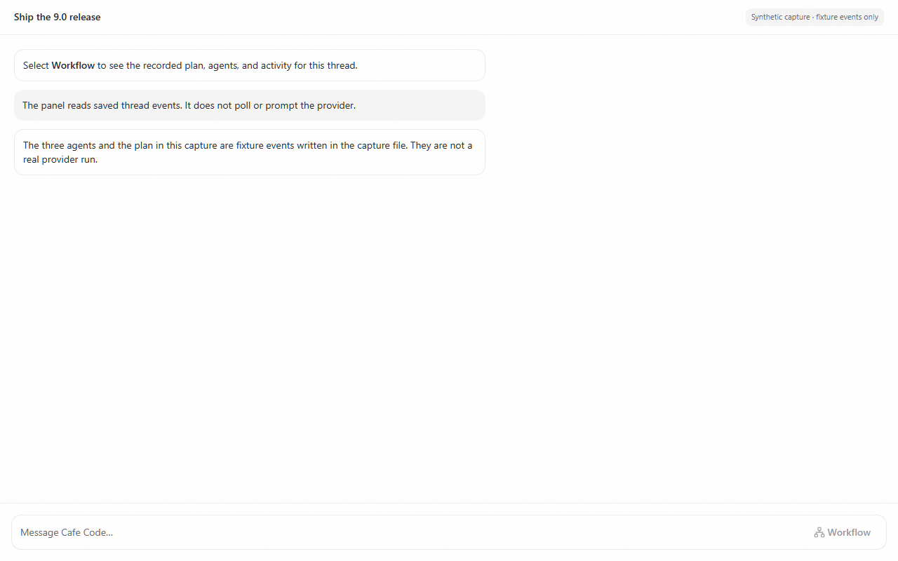
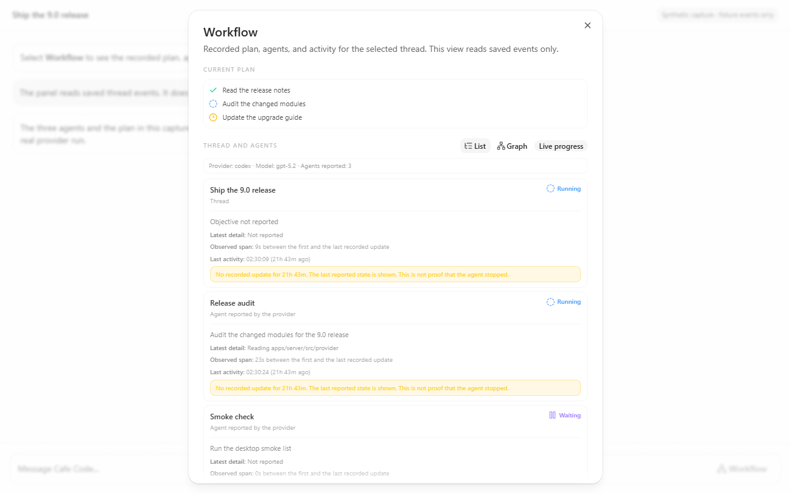
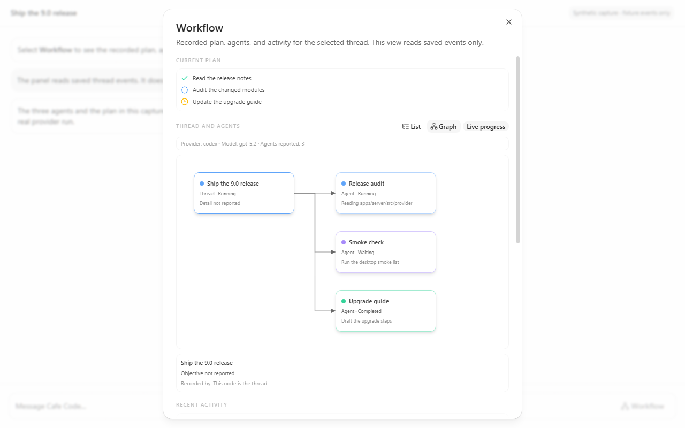

# Workflow observatory

A read-only panel that shows the workflow the selected thread recorded: the current plan, the
thread and its reported agents, recent activity, and the limits of the data.

## Adoption base

| Item                     | Source                                                                                                                                                                                                                                                                                                                     |
| ------------------------ | -------------------------------------------------------------------------------------------------------------------------------------------------------------------------------------------------------------------------------------------------------------------------------------------------------------------------- |
| Reference implementation | `M:/ClubCode-local-release` at `release/local-20260728`: `apps/web/src/components/WorkflowObservatory.tsx`, `apps/web/src/components/WorkflowGraph.tsx`, `apps/web/src/workflowProjection.ts`, `apps/web/src/workflowGraph.ts`, and the `WorkflowProjectionSnapshot` contract in `packages/contracts/src/orchestration.ts` |
| Adoption target          | Cafe `adoption/cafe-dev-workflow-observatory-20260911`, cut from current Cafe dev `99fbaec8`                                                                                                                                                                                                                               |

The Club projection parses the Codex multi-agent protocol directly: `collab_agent_tool_call`
items, `subAgentActivity` items, `agentPath` strings, and `agentsStates` records. Current Cafe
normalizes those shapes inside the provider adapters and persists provider-neutral `task.*`
activities that carry a `RuntimeSubagentPresentation`. Copying the Club structs would add a
second, older reader of a protocol that Cafe no longer stores.

This adoption therefore keeps the Club product shape (list view, graph view, recent activity,
bounded snapshot, explicit fidelity) and writes a new projection over current Cafe state.

## Source fields

`deriveWorkflowProjection` in `apps/web/src/workflowProjection.ts` reads only these sources.

| Projection field                                             | Current Cafe source                                                                                                                                                                              |
| ------------------------------------------------------------ | ------------------------------------------------------------------------------------------------------------------------------------------------------------------------------------------------ |
| Agent identity, label, objective, detail, status, timestamps | `deriveSubagentActivities` in `apps/web/src/subagent-activity.ts`, which coalesces `task.started`, `task.progress`, and `task.completed` with `payload.subagent` (`RuntimeSubagentPresentation`) |
| Thread node title                                            | `thread.title`                                                                                                                                                                                   |
| Thread node status                                           | `thread.latestTurn.state` (`running`, `completed`, `interrupted`, `error`)                                                                                                                       |
| Thread node start and end                                    | `latestTurn.startedAt`, `latestTurn.requestedAt`, `latestTurn.completedAt`                                                                                                                       |
| Provider label                                               | The provider selected for the thread                                                                                                                                                             |
| Model label                                                  | `thread.modelSelection.model`                                                                                                                                                                    |
| Recent activity rows                                         | Persisted activities with kind `task.started`, `task.progress`, `task.completed`, or `turn.plan.updated`                                                                                         |
| Current plan                                                 | `deriveActivePlanState`, which reads `turn.plan.updated`                                                                                                                                         |

The panel reuses `deriveSubagentActivities`, so the observatory, the composer task pill, and the
Atrium always show one agreed lifecycle. Native Cafe event handling and the existing subagent
detail routing are unchanged.

## Limits

The panel states each limit in its own `Limits` section.

- **No new traffic.** The projection reads saved thread events. It does not poll, probe, or prompt
  a provider, and it starts no request when it opens.
- **No agent-to-agent parentage.** Current Cafe adapters report the child identity and the thread
  that recorded it. They report no parent agent. An edge therefore means _this thread recorded this
  agent_. An agent node is never drawn as the parent of another agent node. A shared path is not
  treated as proof of a relationship.
- **No provider duration.** `TaskProgressPayload` and `TaskCompletedPayload` carry no duration, so
  the panel shows `Observed span`, which is the time between the first and the last recorded update
  for that node. A missing timestamp shows `Not reported`.
- **No inferred work.** Status comes from the source only. Age never turns a node into `Running`,
  and nothing is marked complete unless a terminal edge arrived. If a running node has had no
  recorded update for 90 seconds, the card adds a note that says the last reported state is shown
  and that this is not proof that the agent stopped.
- **No invented count.** `Agents reported` counts reported rows. When a provider reports no
  lifecycle, the fidelity badge shows `Not reported` and the panel says so.
- **Missing fields.** Every absent source field renders as `Not reported` instead of a guess.
- **Bounds.** At most 64 nodes, at most 100 recent-activity rows, and at most 512 characters for one
  display string. Omitted nodes, omitted activity rows, and dropped repeated identifiers are counted
  and shown.
- **Unknown parents, cycles, and repeated identifiers.** `deriveWorkflowGraphLayout` in
  `apps/web/src/workflowGraph.ts` places a node with an unknown or cyclic parent at the root level,
  draws no edge for it, and counts it. A repeated node identifier is dropped and counted.
- **Privacy.** The projection does not query account records or credential stores. It displays
  recorded provider text, which can contain sensitive project material. The separate provider history
  binding (`RuntimeSubagentPresentation.historyId`) is not copied into the snapshot or DOM.

### Fidelity

| Badge            | Meaning                                                    |
| ---------------- | ---------------------------------------------------------- |
| `Live progress`  | At least one `task.progress` edge arrived for this thread. |
| `Lifecycle only` | Only start and terminal edges arrived.                     |
| `Not reported`   | The provider recorded no task lifecycle for this thread.   |

## Use the panel

1. Select a thread.
2. Select **Workflow** in the composer controls. On a narrow window, select the composer overflow
   menu, then select **Show workflow**.
3. Select a node title to expand or collapse its details.
4. Select **Graph** to see the nodes and edges. Select **List** to return.

The control opens the panel even when the thread has no proposed plan. The panel is an overlay, so
it does not change the plan sidebar, its responsive behavior, or the persistent chat layout.

On a thread or environment switch the panel closes, the projection is replaced, and the per-node
view state is dropped. While the panel is closed, the projection is the empty snapshot.

## Tests

| Command                                                                                      | Scope                                                                                                                                                                                                                                                                                                                                                                                                        |
| -------------------------------------------------------------------------------------------- | ------------------------------------------------------------------------------------------------------------------------------------------------------------------------------------------------------------------------------------------------------------------------------------------------------------------------------------------------------------------------------------------------------------ |
| `yarn workspace @cafecode/web test src/workflowProjection.test.ts src/workflowGraph.test.ts` | Projection over source events: fidelity, terminal states that survive a replayed progress edge, missing fields, observed spans, node and activity bounds, activity-to-node binding, text bounds, no history binding in the snapshot, and separate nodes for two turns that reuse one identity. Graph layout: unknown parents, cycles, self-reference, repeated identifiers, depth clamping, and determinism. |
| `yarn workspace @cafecode/web test:browser src/components/workflow --maxWorkers=2`           | Real components: the panel opens without a plan, shows reported agents and fidelity, expands and collapses a node, switches between list and graph, replaces data on a thread switch and on an environment switch, states the no-lifecycle case, always states the limits, shows nothing while closed, and the composer control opens the panel.                                                             |

## Review and media

Adoption proposal: [Cafe issue #90](https://github.com/cafeai/cafe-code/issues/90), based on Cafe dev `99fbaec8`.
Independent review checked projection fidelity, bounded output, graph relationships and selection cleanup.
The projection/layout unit tests pass 22/22; component Chromium tests pass 11/11, including identifier
delimiter collisions. Final validation passed `yarn fmt`, `yarn lint`, `yarn typecheck`
(10 tasks), `yarn test --concurrency=2` (10 tasks; server 2,004 passed and the existing
POSIX bootstrap FIFO skip), all 317 Chromium tests, and `yarn build:desktop --force`
(3 tasks). Generated server, desktop and renderer bundles were checked after the build.

The captures show the real dialog and stylesheet with synthetic events. No provider, backend or user
account was involved. The temporary capture harness was removed after the media was inspected.

[Interaction recording (7.68 seconds)](pr-assets/workflow-observatory/interaction.webm)
