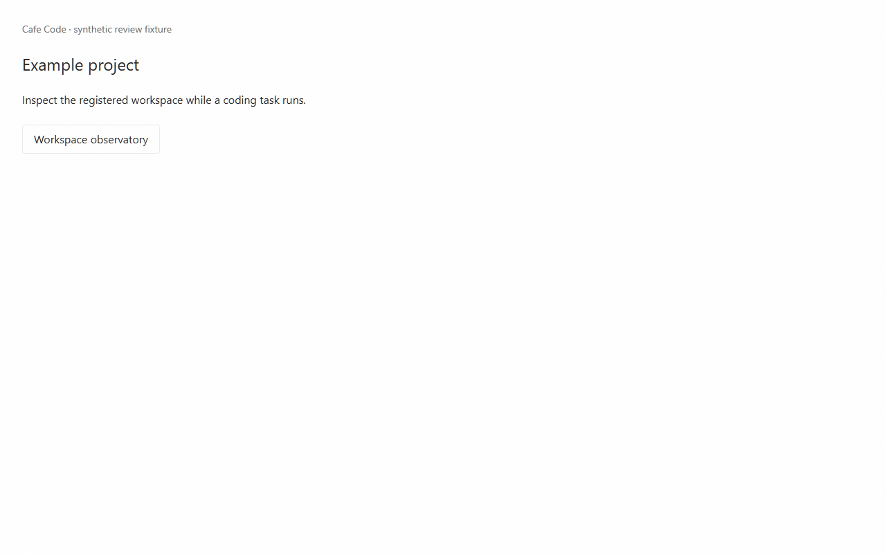
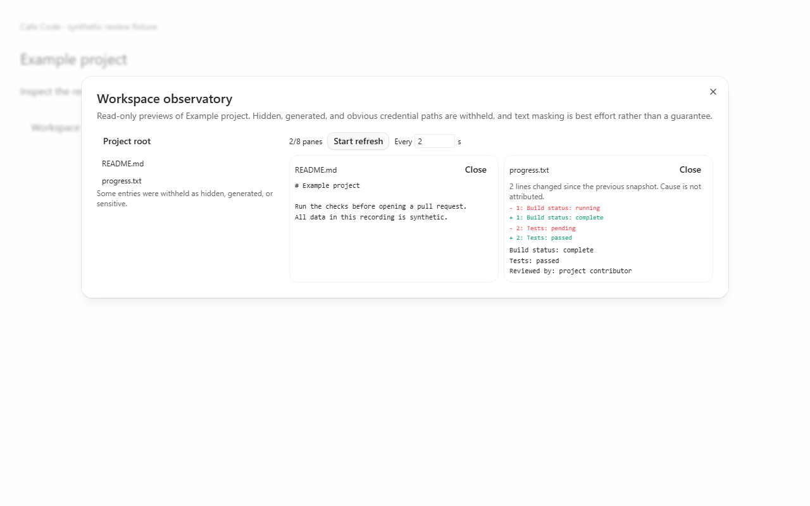

# Workspace observatory

Read-only, bounded previews of the _selected_ project's working tree, exposed over the existing
authenticated websocket RPC and rendered in a dialog beside the chat view.

Adoption proposal: [Cafe issue #87](https://github.com/cafeai/cafe-code/issues/87), based on Cafe dev `99fbaec8`.

## Adoption scope

In scope for this slice:

- Two authenticated RPC methods, `workspaceObservatoryTree` and `workspaceObservatoryReadFile`,
  wired into the existing `WsRpcGroup` and the existing environment API client.
- An Effect service and live layer that resolve the workspace root from the server's own
  orchestration projection for a named `projectId`.
- A dialog that lists one directory at a time, opens up to eight bounded file previews, and offers
  an opt-in refresh timer that starts paused.
- A bounded snapshot diff that shows which lines changed between the two most recent previews of a
  file.

Explicitly **not** in this slice: no SQLite schema, no provider or agent attribution, no writes, no
process execution, no caller-supplied filesystem root, and no always-on polling.

## Limits and guarantees

| Bound                            | Value                         | Where                                                                          |
| -------------------------------- | ----------------------------- | ------------------------------------------------------------------------------ |
| Directory entries per listing    | 500                           | `WORKSPACE_OBSERVATORY_LIMITS.treeEntries`                                     |
| File preview bytes               | 128 KiB                       | `WORKSPACE_OBSERVATORY_LIMITS.textBytes`                                       |
| Relative path characters         | 512                           | `WORKSPACE_OBSERVATORY_LIMITS.relativePathLength`                              |
| Concurrent filesystem operations | 4, process-wide               | `WORKSPACE_OBSERVATORY_MAX_CONCURRENT_OPERATIONS`                              |
| Filesystem stage deadline        | 5 s                           | `WORKSPACE_OBSERVATORY_OPERATION_TIMEOUT_MS`                                   |
| `lstat` fallbacks per listing    | 64                            | `WORKSPACE_OBSERVATORY_ENTRY_METADATA_BUDGET`                                  |
| Open preview panes               | 8, pending reads included     | `WORKSPACE_OBSERVATORY_MAX_PANES`                                              |
| Diff entries retained / rendered | 200 / 12                      | `WORKSPACE_OBSERVATORY_DIFF_LIMIT`, `WORKSPACE_OBSERVATORY_VISIBLE_DIFF_LINES` |
| Refresh interval                 | 2-60 s, opt-in, starts paused | `WORKSPACE_OBSERVATORY_MIN/MAX_REFRESH_SECONDS`                                |

What is withheld: hidden entries (leading `.`), generated and repository-internal directories
(`.git`, `node_modules`, `dist`, `build`, `out`, `target`, `.turbo`, `.hg`, `.svn`), names that look
like credentials (`.env`, `*.pem`, `*.key`, `*.p12`, `*.pfx`, `id_rsa`, and `auth`/`secret`/`token`
/`session`/`credentials`/`private` name parts), symlinks and reparse points, and anything whose real
location falls outside the root. Binary and non-UTF-8 files are refused rather than rendered.

Segments that Windows interprets ambiguously are refused on **every** platform so behaviour is
identical everywhere: any `:` (NTFS alternate data streams such as `notes.txt:hidden`, and
drive-relative forms such as `C:file`), trailing dots or spaces (Win32 strips them, so `secret.pem.`
and `secret.pem` name one file through two spellings), reserved device names (`NUL`, `COM1`, ...),
wildcard and redirection characters, and control characters.

Paths retain their exact spelling through RPC decoding. A leading space belongs to the filename;
it is never trimmed into a different file. Root resolution and the selected read or listing use
separate admitted filesystem stages, so 5 seconds is not an end-to-end request deadline.

### Residual limitations

Read these before relying on the observatory for anything security-sensitive.

1. **Redaction is best effort, not a boundary.** Name filtering and text masking reduce accidental
   shoulder-surfing of obvious credential shapes. An un-redacted preview is _not_ evidence that a
   file holds no secrets.
2. **Path checking is not atomic.** Node exposes no portable directory-relative (`openat`-style)
   traversal, so the `lstat` / `realpath` / `open` sequence has a window in which a writer who
   already controls a directory inside the workspace can swap a path component. `O_NOFOLLOW`, the
   descriptor's own `fstat`, and a device/inode comparison after opening narrow that window and
   cover the ordinary cases; they do not close it. The observatory is a convenience view for whoever
   already owns the workspace, not a sandbox against a hostile co-writer of that workspace.
3. **A wedged filesystem degrades to refusals, by design.** A timed-out operation keeps its
   admission slot until the underlying promise actually settles, because Node cannot cancel it. Once
   enough operations are wedged, further requests are refused with `busy` rather than spawning more
   blocked libuv workers. Refusing is the intended outcome; it is not a crash.
4. **Diffs describe the file, never a cause.** The observatory compares two snapshots it fetched. It
   has no idea what wrote the file and must not be read as attributing a change to an agent.
5. **A failed refresh is shown as stale, not hidden.** When a refresh read fails, the pane keeps its
   last values and is labelled stale with the refusal text, so nothing looks freshly fetched when it
   is not.

## Prerequisites

- The project must already be registered in the server's orchestration projection with a
  `workspaceRoot`; an unregistered `projectId` is refused as `unknown-project`.
- The caller must hold an authenticated websocket RPC session. There is no unauthenticated path.
- `WorkspaceObservatoryLive` is layered above `OrchestrationLayerLive` in `server.ts`, because it
  reads the projection to resolve the root.

## Validation actually run

From the worktree at `adoption/cafe-dev-workspace-observatory-20260911`, on Windows:

- `tsc --noEmit` in `apps/server` and in `apps/web` - clean.
- `vitest run src/workspace/Layers/WorkspaceObservatory.test.ts` (apps/server) - 41 passed,
  1 skipped. The skip is the POSIX-only named-pipe case; Windows does not create FIFOs through the
  filesystem namespace, and the same precheck is covered there by the directory case.
- `vitest run src/server.test.ts -t "read-only workspace views"` (apps/server) - 1 passed. This runs
  the real authenticated websocket RPC path against a synthetic temporary workspace and asserts the
  listing, a file read, and refusals for `.env`, `session.pem`, `../outside/secret.txt`, an absolute
  path, `README.md:hidden`, and an unregistered project. It also asserts no refusal message contains
  the fixture path or the word `secret`.
- `vitest run --config vitest.browser.config.ts src/components/WorkspaceObservatory.browser.tsx`
  (apps/web) - 17 passed, including out-of-order directory responses, click deduplication, the
  pending-read ceiling, a closed pane's late response, stale-on-failed-refresh, and bounded diff
  rendering.
- `oxfmt --check` and `oxlint --report-unused-disable-directives` on the changed paths - clean.

Independent review repaired exact path decoding, environment/project session-key collisions, and
quadratic credential-name matching. The 128 KiB non-assignment regression took 2.26 seconds before
the repair and passes a generous one-second ceiling after it. Text masking remains best effort.

Full repository checks and the forced desktop build are pending final publication validation.

## Review media

The real component and stylesheet render synthetic data only. No account or user workspace was captured.

[Interaction recording (11.12 seconds)](pr-assets/workspace-observatory/interaction.webm)
